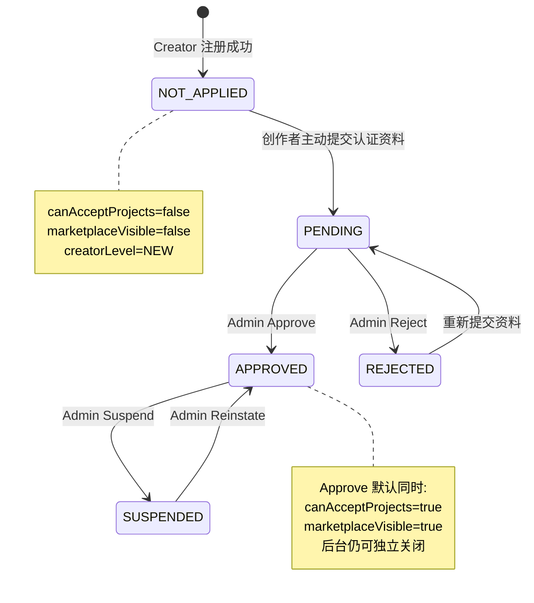
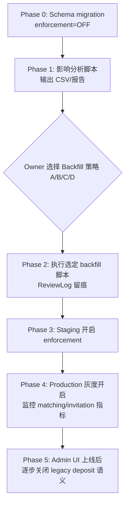

# VINCIS Creator Lifecycle Spec

> **文档性质：** Creator 权限、平台认证、市场可见性与接单资格的正式业务规范。  
> **优先级：** 与 `docs/VINCIS_ORDER_LIFECYCLE_SPEC.md` 并列；涉及匹配、邀约、Proposal、公开主页时，本规范为 Creator 侧权限真相。  
> **路线图优先级（Owner 2026-07-24 最终拍板）：**  
> Sprint C ✅ → **Sprint D 文档**（`docs/VINCIS_DIRECTOR.md`，不写代码）→ **Creator-1 实现** → **Sprint D 实现**  
> **原因：** Director 的 Creator 推荐 / 匹配 / Brief 依赖 `CreatorEligibility`；Creator-1 是 Director 的基础设施。  
> **文档状态：** **已冻结**（2026-07-24）；代码以本文 + Director 文档为准。  
> **最后更新：** 2026-07-24（v1.0 收口 + BOOKED + 路线重排）

相关文档：

- 订单 / 邀约 / 选定闭环：`docs/VINCIS_ORDER_LIFECYCLE_SPEC.md`
- Video Engine 基线：`docs/VIDEO_ENGINE.md`
- VINCIS Director（设计）：`docs/VINCIS_DIRECTOR.md`
- AI 匹配权重：`docs/AI_PREFERENCE_ENGINE.md`

---

## 1. 核心原则

### 1.1 注册成功 ≠ 可以接单

Creator 注册完成后**默认**拥有：

- AI Canvas（图片 / 视频 / 音乐）
- Credits
- 作品管理
- Portfolio 编辑
- 个人资料编辑
- 学习中心（Academy）

Creator 注册完成后**默认没有**：

- 接收项目邀约
- 被 AI 匹配推荐
- 出现在 Creator Marketplace / 品牌搜索
- 提交 Proposal / 接单入口

**语义分离：**

| 用户理解 | 系统含义 |
|----------|----------|
| 注册成功 = **AI Creator** | 可使用 Canvas 与 Portfolio，但无商业接单权限 |
| 平台审核通过 = **VINCIS Verified Creator** | `verificationStatus === APPROVED`，可展示官方认证徽章 |
| 付费会员 = **Creator Pro / VINCIS Pro** | 更低佣金等会员权益；**不等于**平台官方认证 |

### 1.2 权限与身份模型（五维 + 身份类型）

禁止新增 `verified: true` 一类不可扩展字段。Creator 平台能力由 **五个业务维度 + 身份类型** 组成：

| 维度 | 字段 | 含义 |
|------|------|------|
| 平台认证状态 | `verificationStatus` | 是否通过 VINCIS 官方 Creator 认证审核 |
| 接单开关 | `canAcceptProjects` | 是否允许接收新邀约 / 新 Proposal / 新订单入口 |
| 市场展示开关 | `marketplaceVisible` | 是否允许在 Marketplace / 品牌搜索 / 公开主页索引中展示 |
| 运营等级 | `creatorLevel` | NEW / ESTABLISHED / PROFESSIONAL / PARTNER / FEATURED；影响排序权重，**不替代**认证 |
| 档期状态 | `availability` | AVAILABLE / LIMITED / BUSY / **BOOKED** / VACATION / UNAVAILABLE（`OFFLINE` legacy alias） |
| 身份类型 | `identityType` | INDIVIDUAL / STUDIO / COMPANY / OFFICIAL（见 §1.3） |

**Reputation Score（0–100）** 属于 **Creator-2/3** 独立演进维度（完成率、准时率、Brand Rating 等），**不在 Creator-1 计算或落库**；Creator-1 仅在 `CreatorEligibility` 接口预留只读扩展点（见 §3.6）。

**关键规则：`marketplaceVisible` 与 `canAcceptProjects` 必须独立。**

创作者可以暂停接单（`canAcceptProjects = false`），但继续展示公开主页与作品集（`marketplaceVisible = true`），以积累长期品牌资产。

### 1.3 Creator Identity（身份类型）

Creator 不只是「个人账号」，未来 Marketplace 必须支持按身份筛选（企业客户核心需求）。

```text
INDIVIDUAL  — 个人创作者（默认）
STUDIO      — 工作室 / 制作团队
COMPANY     — 公司主体
OFFICIAL    — 品牌官方账号（平台特批）
```

**Creator-1：** 落库 `identityType` 字段（默认 `INDIVIDUAL`），写入 ReviewLog；**不做** Marketplace 筛选 UI。  
**Creator-2+：** 品牌搜索「只搜 Studio / Company」、Official 徽章策略。

### 1.4 Availability（档期，非 Boolean）

现有 `CreatorAvailability` 枚举含 `AVAILABLE | BUSY | VACATION | OFFLINE`。Creator-1 **新增** `LIMITED`、`UNAVAILABLE`、`BOOKED`（`OFFLINE` 视为 `UNAVAILABLE` 的 legacy alias，不再新增使用）。

| 状态 | 品牌可见语义 | 匹配 / 邀约 |
|------|--------------|-------------|
| `AVAILABLE` | 开放合作 | 正常进入候选池 |
| `LIMITED` | 档期有限 | 可匹配；UI 展示 Limited 标签 |
| `BUSY` | 忙碌 | 可匹配；排序降权 |
| `BOOKED` | 未来档期已满，仍在履约 | **硬过滤**（不接新单）；与 VACATION 不同（仍在工作） |
| `VACATION` | 休假 | matching 硬过滤 |
| `UNAVAILABLE` | 不可用 | matching 硬过滤 |
| `OFFLINE` | （legacy） | 同 `UNAVAILABLE` |

**不得**用 `canAcceptProjects=false` 替代 VACATION/BOOKED/UNAVAILABLE 的语义；两者独立（暂停接单 vs 档期状态）。

### 1.5 认证与付费必须彻底解耦

- **官方认证徽章** 只能由 `verificationStatus === APPROVED` 决定，展示文案为 **「VINCIS Verified Creator」**。
- **Membership 套餐** 不得再使用「Verified Creator」作为对用户可见名称（见 §9）。
- **认证保证金（Deposit）** 是独立风控/信任机制，**不等于** `verificationStatus`；`isCreatorVerified()` 当前实际判断保证金，必须 deprecated（见 §9）。

---

## 2. 正式状态机

### 2.1 `verificationStatus` 枚举

```text
NOT_APPLIED   — 注册后默认；尚未提交认证资料
PENDING       — 创作者主动提交认证资料后
APPROVED      — 管理员 Approve
REJECTED      — 管理员 Reject；可修改后重新提交
SUSPENDED     — 管理员 Suspend；平台强制下线
```

### 2.2 生命周期（Mermaid）



### 2.3 各节点系统行为（Owner 正式决策）

#### 注册成功（默认）

```text
verificationStatus   = NOT_APPLIED
canAcceptProjects      = false
marketplaceVisible     = false
creatorLevel           = NEW
```

#### 创作者主动提交认证资料

```text
verificationStatus     = PENDING
verificationAppliedAt  = now()
```

> Creator-1 **不实现** 提交 UI；此转换仅由后续 Creator Apply 流程或 Admin 脚本触发。  
> Creator-1 **不得** 自动将任何用户设为 PENDING 或 APPROVED。

#### 管理员 Approve（默认副作用）

```text
verificationStatus        = APPROVED
canAcceptProjects         = true
marketplaceVisible        = true
verificationReviewedAt    = now()
verificationReviewedBy    = currentAdminId
```

后台仍可对已 APPROVED 创作者**独立**设置：

- `canAcceptProjects = false`（暂停接单，主页仍可展示）
- `marketplaceVisible = false`（从市场隐藏，仍可内部接单若 canAcceptProjects 为 true——由 Admin 策略决定）

#### 管理员 Reject

```text
verificationStatus        = REJECTED
canAcceptProjects         = false   （保持或显式关闭）
marketplaceVisible        = false
verificationReviewedAt    = now()
verificationReviewedBy    = currentAdminId
```

#### 管理员 Suspend

```text
verificationStatus        = SUSPENDED
canAcceptProjects         = false
marketplaceVisible        = false  （建议默认；Admin 可保留展示但禁止接单）
```

---

## 3. 统一权限：`CreatorEligibility`（唯一真相）

所有 matching、invitation、proposal、公开主页入口 **必须** 通过 `creator-eligibility.service` 获取 **`CreatorEligibility` 快照**，禁止在 UI / Action 层散落硬编码或只调用单一 `canAcceptProjects()`。

### 3.1 `CreatorEligibility` 结构（建议）

```typescript
type CreatorEligibility = {
  canUseAiTools: boolean;
  canAppearInMarketplace: boolean;
  canReceiveInvitations: boolean;
  canSubmitProposal: boolean;
  canAcceptProject: boolean;
  canPublishPortfolio: boolean;
  reasons: CreatorEligibilityReason[];
};
```

**规则摘要（enforcement ON）：**

| 能力 | 条件 |
|------|------|
| `canUseAiTools` | 注册 Creator + ACTIVE |
| `canPublishPortfolio` | 注册 Creator + ACTIVE |
| `canAppearInMarketplace` | APPROVED + marketplaceVisible + ACTIVE |
| `canReceiveInvitations` | APPROVED + canAcceptProjects + 非 VACATION/UNAVAILABLE/OFFLINE + ACTIVE |
| `canSubmitProposal` / `canAcceptProject` | 上列 + deposit/风控 guard 叠加 |

对外仍提供语义化函数，但内部统一计算一次：

```typescript
function resolveCreatorEligibility(profile, legacy, enforcementEnabled): CreatorEligibility;
```

### 3.2 `marketplace`（原 canAppearInMarketplace）

```text
verificationStatus === APPROVED
&& marketplaceVisible === true
```

用于：品牌搜索、Match Board 公开展示、公开 `/creators/[id]` 索引（非 owner 预览）、Marketplace 列表。

**不得** 要求 `canAcceptProjects === true`。

### 3.3 `invitation`（原 canReceiveInvitations）

```text
verificationStatus === APPROVED
&& canAcceptProjects === true
&& user.status === ACTIVE
&& user.deletedAt IS NULL
&& availability NOT IN (VACATION, OFFLINE)   // LIMITED / BUSY / AVAILABLE 允许
```

### 3.4 `proposal` / `acceptProject`

```text
verificationStatus === APPROVED
&& canAcceptProjects === true
&& user.status === ACTIVE
&& user.deletedAt IS NULL
&& 其他现有交易与风控 guard 通过
```

- **`proposal`** — 提交 Proposal / Quote / `applyToProjectAction`
- **`acceptProject`** — 接受邀约、Studio 商业入口（与 deposit / 首单免费 **叠加**）

### 3.5 `portfolioPublic`

```text
verificationStatus === APPROVED
&& marketplaceVisible === true
```

用于：非 owner 访问 `/creators/[id]`、公开 Portfolio 索引（可与 `marketplace` 同真值，保留独立扩展口）。

### 3.6 与 Deposit / Feature Flag 的关系

当前 `lib/studioos/deposit-guard.ts` 中：

- `hasPaidCreatorDeposit()` → `deposit_status === "paid"`
- `isCreatorVerified()` → **alias of deposit paid（错误语义，deprecated）**
- `canAcceptCreatorOrders()` → 首单免费 **或** 保证金已付

**Creator-1 不删除 deposit 机制**，但 eligibility 层必须 **先** 过 `canAcceptProjects(profile)`，**再** 过 deposit guard（当 feature flag 开启时）。

当 `creator.lifecycle.enforcement === false` 时，行为回退到 **当前 production 逻辑**。

### 3.7 Reputation Score（Creator-2/3，非 Creator-1）

未来排序公式（文档级约定）：

```text
finalRank = AI Match Score
            + w1 * normalize(reputationScore)
            + w2 * creatorLevelWeight
```

`reputationScore`（0–100）由 AI 基于完成率、准时率、修改轮次、投诉率、回复速度、Brand Rating 等 **运营数据** 计算。  
**Creator-1：** 仅在上文 `CreatorEligibility` 类型预留 `reputationScore?: null`；**不建表、不计算、不参与排序**。

---

## 4. Creator Timeline（基于 ReviewLog）

运营、客服、风控、AI 必须能查看 Creator **完整生命周期时间轴**，数据 **只读** 来自 `CreatorVerificationReviewLog` + `CreatorProfile.createdAt`（禁止手工维护平行时间线）。

### 4.1 时间轴事件（示例）

```text
2026-07-01  注册                    ← profile.createdAt
2026-07-02  提交认证                ← action=SUBMIT
2026-07-04  审核通过                ← action=APPROVE
2026-07-06  Marketplace 开启        ← action=TOGGLE_MARKETPLACE_VISIBLE (new=true)
2026-07-12  暂停接单                ← action=TOGGLE_CAN_ACCEPT (new=false)
2026-07-20  恢复                    ← action=REINSTATE
```

### 4.2 Creator-1 交付

| 交付物 | 说明 |
|--------|------|
| `creator-timeline.service.ts` | `listTimeline(creatorProfileId)` → 按 `createdAt` 排序的事件 DTO |
| Admin API（可选） | `GET /api/v1/admin/creators/:id/timeline` — **无 UI**（UI 属 Creator-2） |
| ReviewLog 扩展 action | 增加 `SET_IDENTITY` / `SET_AVAILABILITY`（写入 identityType / availability 变更） |

每条 Timeline 项：`{ at, kind, label, adminId?, reason?, snapshot? }`，**不得** 与 ReviewLog 不一致。

---

## 5. 审计日志：`CreatorVerificationReviewLog`

每次 Admin（或未来系统动作）改变认证相关字段，**必须**写入日志。

### 5.1 必填字段

| 字段 | 说明 |
|------|------|
| `creatorProfileId` | FK → `creator_profiles.id` |
| `action` | SUBMIT / APPROVE / REJECT / SUSPEND / REINSTATE / TOGGLE_CAN_ACCEPT / TOGGLE_MARKETPLACE_VISIBLE / SET_LEVEL / SET_IDENTITY / SET_AVAILABILITY |
| `previousVerificationStatus` | 变更前 |
| `newVerificationStatus` | 变更后 |
| `previousCanAcceptProjects` | 变更前 |
| `newCanAcceptProjects` | 变更后 |
| `previousMarketplaceVisible` | 变更前 |
| `newMarketplaceVisible` | 变更后 |
| `adminId` | FK → `admin_users.id`；系统动作可为 null |
| `reason` | 对外/对创作者可见原因（Reject/Suspend 必填） |
| `internalNotes` | 内部备注 |
| `snapshot` | JSON：变更时 profile 关键字段快照 |
| `createdAt` | 时间戳 |

Creator-1 实现 **Repository + Service 写入 + Timeline 只读**；Admin Review UI 不在范围内。

---

## 6. Creator-1 范围边界

### 6.1 Creator-1 必须实现

| # | 交付物 |
|---|--------|
| 1 | Prisma：verification 四维 + `identityType` + `CreatorAvailability.LIMITED` |
| 2 | `CreatorVerificationReviewLog` 表 |
| 3 | `creator-eligibility.service` — 统一 `CreatorEligibility` 快照 |
| 4 | `creator-timeline.service` — ReviewLog 时间轴 |
| 5 | Matching / Invitation / Proposal 硬过滤 |
| 6 | `isCreatorVerified` 审计 + deprecated |
| 7 | Feature flag + **Owner 可选 Backfill A/B/C/D 脚本**（非 migration 内写死） |
| 8 | `scripts/analyze-creator-lifecycle-impact.ts` |
| 9 | 自动化测试 |
| 10 | 本文档 |

### 6.2 Creator-1 明确不实现

- Creator 端认证申请 UI
- Admin Creator Review **UI**（Timeline API 可先做）
- Marketplace 按 IdentityType 筛选 UI
- **Reputation Score** 计算与排序权重
- Membership 重命名 / Stripe 改动（Phase 2 独立 PR）
- 历史用户 **migration 内** 自动 bulk APPROVED

### 6.3 与 Video Engine 的关系

| 轨道 | 范围 | PR |
|------|------|-----|
| **Sprint C** | Video Engine 审计表 | ✅ 已完成 |
| **Sprint D** | VINCIS Director | 下一优先 |
| **Creator-1** | Creator 权限 + eligibility | Sprint D 之后 |

**禁止** Creator-1 与 Sprint D 混改。

---

## 7. 当前代码差距（2026-07-24 审计）

| 概念 | 当前实现 | 问题 |
|------|----------|------|
| `verificationStatus` | **不存在** | 无 NOT_APPLIED / PENDING / APPROVED 流程 |
| `canAcceptProjects` | `canAcceptCreatorOrders()` ≈ 首单免费 + 保证金 | 语义是 deposit，不是平台审核 |
| `marketplaceVisible` | **不存在** | 无统一市场展示开关 |
| `creatorLevel` | **不存在** | 仅有 Membership `VERIFIED` planType |
| 「Verified Creator」徽章 | `isCreatorVerified()` = **保证金已付** | 与官方认证混淆 |
| Prisma matching | `matching.service` 拉全部 `ACTIVE` Creator | **无** verification 过滤 |
| Legacy matching | `matching-engine` 要求 `deposit_status=paid` + profile complete | 与 Prisma 路径不一致 |
| Admin 审核 | `/admin/certification` 处理 **保证金表单** | 非 Creator Review |
| `identityType` | **不存在** | 无法区分 Individual / Studio / Company |
| `LIMITED` availability | enum 无 LIMITED | 档期粒度不足 |
| Reputation | **不存在** | Creator-2/3；Creator-1 不实现 |

---

## 8. 历史数据与部署安全（最高优先级）

### 8.1 Migration 默认值（schema 层）

对所有现有 `creator_profiles` 行，migration **只写入安全默认**：

```text
verificationStatus   = NOT_APPLIED
canAcceptProjects    = false
marketplaceVisible   = false
creatorLevel         = NEW
identityType         = INDIVIDUAL
```

**禁止** migration SQL 内 `UPDATE ... SET verification_status = 'APPROVED'` — 历史状态变更 **只能** 由 Owner 选定 Backfill 策略后、通过 **独立脚本** 执行，且每条必须写入 ReviewLog。

### 8.2 风险说明

若在 **未做 backfill、未开 feature flag 保护** 的情况下，直接将 `creator.lifecycle.enforcement` 设为 `true`：

- 所有现有创作者的 AI matching 候选池将为 **空**
- 新邀约无法触达此前可接单的创作者
- Proposal / Quote 入口将被 eligibility 层拒绝
- 公开主页 / 品牌 Match Board 可能整体消失

**Owner 要求：历史创作者不能在 deploy 后突然全部失去接单资格；因此 Backfill 策略由 Owner 在 migration 后、开启 enforcement 前 **主动选择**，不得写死为单一方案。**

### 8.3 强制 Rollout 流程



**Creator-1 交付物必须包含：**

1. `scripts/analyze-creator-lifecycle-impact.ts` — migration **后**、backfill **前**运行，输出各策略影响人数  
2. `scripts/backfill-creator-verification.ts` — 接受 `--strategy=A|B|C|D`，**Owner 手动执行**  
3. Feature flag `creator.lifecycle.enforcement`（默认 `false`）  
4. 可选 flag `creator.lifecycle.enforcement.matching_only` 用于分阶段  

### 8.4 Backfill 策略 A/B/C/D（Owner 迁移前选择，不写死）

| 策略 | 条件 | 写入 | 典型场景 |
|------|------|------|----------|
| **A. 最安全** | 全部现有创作者 | 保持 `NOT_APPLIED` + flags false | 新环境 / 冷启动 / 愿意人工逐批审核 |
| **B. 保证金 grandfather** | `deposit_status = PAID` | `APPROVED` + `canAcceptProjects=true` + `marketplaceVisible=true` + ReviewLog | 已有保证金、正在接单的创作者 |
| **C. 保证金 + 资料完整** | `deposit_status = PAID` ∧ `profileCompletedAt IS NOT NULL` | 同 B | 更严格；排除资料未完成的保证金用户 |
| **D. 管理员 CSV 确认** | Owner 提供 CSV（`creatorProfileId` 列表） | 逐行 `APPROVED` + ReviewLog（`reason` 含 batch id） | 生产环境推荐；人工终审 |

**执行顺序：**

```text
1. db:migrate:deploy          → schema 安全默认（全员 NOT_APPLIED）
2. analyze-creator-lifecycle  → Owner 审阅 CSV/报告
3. Owner 选定 A / B / C / D
4. backfill-creator-verification --strategy=X --dry-run
5. Owner 确认 dry-run 输出
6. backfill-creator-verification --strategy=X --execute
7. Staging enforcement ON → 验证 → Production 灰度
```

**Deploy 门禁：** 若 `would_lose_matching_if_enforced > 0`（策略 A 或零 backfill）且 Owner **未** 明确选择策略 A → **禁止** production 开启 enforcement。

---

## 9. Membership「Verified Creator」重命名方案

> Creator-1 **不改** 会员计费逻辑；本节为 **安全重命名设计**，建议在 **Creator-1 之后、Creator-2 之前** 或独立 copy PR 实施。

### 9.1 问题

当前 Membership 套餐：

- DB slug: `verified-creator`
- planType: `VERIFIED`
- 用户可见名: **「Verified Creator」**

用户会误解为 **付费 = 官方平台认证**，与 `verificationStatus === APPROVED` 冲突。

### 9.2 建议正式名称

| 层级 | 现值 | 建议新值 |
|------|------|----------|
| 用户可见套餐名 | Verified Creator | **Creator Pro**（首选）或 **VINCIS Pro** |
| 中文 | Verified Creator / 已认证创作者 | **Creator Pro 会员** / **VINCIS Pro 会员** |
| 官方认证徽章 | （与会员混用） | **VINCIS Verified Creator**（仅 `verificationStatus=APPROVED`） |
| DB slug | `verified-creator` | **Phase 1 保留 slug**；新增 `creator-pro` alias 或 displayName 覆盖 |
| planType enum | `VERIFIED` | **Phase 1 保留**；代码注释 + UI copy 分离；Phase 2 评估 `PRO` enum |

### 9.3 代码 / UI 影响面（审计清单）

| 区域 | 文件 | 改动类型 |
|------|------|----------|
| Seed | `prisma/seed.ts` | plan `name` → Creator Pro |
| Membership service | `features/membership/membership.service.ts` | 错误文案 `Verified creator plan` |
| UI 面板 | `components/studioos/creator-membership-panel.tsx` | Badge 文案 |
| 升级弹窗 | `components/studioos/creator-membership-upgrade-dialog.tsx` | 标题/描述 |
| 公开资料编辑 | `components/creator/creator-public-profile-editor.tsx` | `verifiedCreator` copy 与认证徽章分离 |
| 通知 | `features/notification/notification-copy.ts` | 会员激活/过期模板 |
| Admin | `app/admin/membership/page.tsx` | 表单 label |
| Commission | `CommissionRule.verifiedCreatorCommissionPercentage` | **DB 列名 Phase 1 不动**；UI 改「Pro 佣金」 |
| 类型 | `CreatorMembershipPlanType.VERIFIED` | enum 保留，文档标注 deprecated 别名 |

### 9.4 安全原则

- **Slug / Stripe Price ID 不在 Creator-1 改动**，避免破坏续费。
- UI 层先改 **display name**；代码中 `planType === "VERIFIED"` 可加注释 `// Creator Pro tier, not platform verification`.
- 认证徽章组件必须 **只读** `verificationStatus`，**禁止**读 membership planType。

---

## 10. `isCreatorVerified()` Deprecation

### 10.1 当前真相

```typescript
// lib/studioos/deposit-guard.ts
export function hasPaidCreatorDeposit(creator) {
  return creator?.deposit_status === "paid";
}
export function isCreatorVerified(creator) {
  return hasPaidCreatorDeposit(creator); // 实际 = 保证金，不是平台认证
}
```

### 10.2 Creator-1 要求

1. `isCreatorVerified()` 标记 `@deprecated`，JSDoc 指向 `hasPaidCreatorDeposit()` 与 `creatorEligibility.isPlatformVerified()`。
2. 新代码 **禁止** 调用 `isCreatorVerified()`。
3. 官方认证 UI 必须改用 `verificationStatus === APPROVED`。

### 10.3 直接调用点清单

| 文件 | 用途 | Creator-1 动作 |
|------|------|----------------|
| `lib/studioos/deposit-guard.ts` | 定义 + 内部 `getCreatorAccessState` | 保留 deprecated wrapper |
| `app/studio/page.tsx` | Level-up / welcome 条件 | 审计：区分 deposit vs platform verify |
| `app/brand/projects/[id]/studios/page.tsx` | 品牌侧创作者徽章 | 改为 `verificationStatus`（flag ON 时） |
| `components/studioos/certification/creator-message-identity.tsx` | 身份消息徽章 | 改为 platform verify 或 deposit copy 分离 |

### 10.4 同类语义混淆点（需一并审计）

| 文件 | 当前判断 | 应分离为 |
|------|----------|----------|
| `lib/studioos/creator-certification-access.ts` | `deposit_status === "paid"` | deposit + eligibility |
| `components/creator/creator-profile-studio.tsx` | deposit ∨ profile_complete | 平台认证徽章独立 |
| `components/creator/creator-public-profile.tsx` | deposit → profileBadge | 仅 APPROVED 显示 VINCIS Verified |
| `components/studioos/studio-workspace-dashboard.tsx` | `deposit_status === "paid"` | certified → depositPaid |
| `lib/matching-engine.ts` | deposit + profile_complete | `canReceiveInvitations` when flag ON |
| `lib/studioos/brand-match-recommendations.ts` | `profile_completed_at` as verified | `canAppearInMarketplace` |
| `features/membership/membership.service.ts` | `isVerified: planType === VERIFIED` |  rename to `isProMember` |

---

## 11. Creator-1 实施设计（Owner 已确认，Sprint D 完成后编码）

### 11.1 最终 Prisma 模型

#### 新增 enum

```prisma
enum CreatorVerificationStatus {
  NOT_APPLIED
  PENDING
  APPROVED
  REJECTED
  SUSPENDED
}

enum CreatorLevel {
  NEW
  STANDARD
  PREFERRED
  TOP
}

enum CreatorVerificationReviewAction {
  SUBMIT
  APPROVE
  REJECT
  SUSPEND
  REINSTATE
  TOGGLE_CAN_ACCEPT
  TOGGLE_MARKETPLACE_VISIBLE
  SET_LEVEL
  SET_IDENTITY
  SET_AVAILABILITY
}

enum CreatorIdentityType {
  INDIVIDUAL
  STUDIO
  COMPANY
  OFFICIAL
}
```

`CreatorAvailability` 枚举 **新增** `LIMITED`（现有 AVAILABLE / BUSY / VACATION / OFFLINE 保留）。

#### `CreatorProfile` 扩展字段

```prisma
model CreatorProfile {
  // ... existing fields ...

  verificationStatus            CreatorVerificationStatus @default(NOT_APPLIED) @map("verification_status")
  canAcceptProjects             Boolean                   @default(false) @map("can_accept_projects")
  marketplaceVisible            Boolean                   @default(false) @map("marketplace_visible")
  creatorLevel                  CreatorLevel              @default(NEW) @map("creator_level")
  identityType                  CreatorIdentityType       @default(INDIVIDUAL) @map("identity_type")
  verificationAppliedAt         DateTime?                 @map("verification_applied_at")
  verificationReviewedAt        DateTime?                 @map("verification_reviewed_at")
  verificationReviewedByAdminId String?                   @map("verification_reviewed_by_admin_id")

  verificationReviewedByAdmin   AdminUser?                @relation("CreatorVerificationReviewedBy", fields: [verificationReviewedByAdminId], references: [id])
  verificationReviewLogs        CreatorVerificationReviewLog[]

  @@index([verificationStatus])
  @@index([canAcceptProjects])
  @@index([marketplaceVisible])
  @@index([creatorLevel])
  @@index([identityType])
}
```

#### `CreatorVerificationReviewLog`

```prisma
model CreatorVerificationReviewLog {
  id                           String                         @id @default(uuid())
  creatorProfileId             String                         @map("creator_profile_id")
  action                       CreatorVerificationReviewAction
  previousVerificationStatus   CreatorVerificationStatus?     @map("previous_verification_status")
  newVerificationStatus        CreatorVerificationStatus?     @map("new_verification_status")
  previousCanAcceptProjects    Boolean?                       @map("previous_can_accept_projects")
  newCanAcceptProjects         Boolean?                       @map("new_can_accept_projects")
  previousMarketplaceVisible   Boolean?                       @map("previous_marketplace_visible")
  newMarketplaceVisible        Boolean?                       @map("new_marketplace_visible")
  adminId                      String?                        @map("admin_id")
  reason                       String?
  internalNotes                String?                        @map("internal_notes")
  snapshotJson                 Json                           @map("snapshot_json")
  createdAt                    DateTime                       @default(now()) @map("created_at")

  creatorProfile CreatorProfile @relation(fields: [creatorProfileId], references: [id], onDelete: Cascade)
  admin          AdminUser?     @relation(fields: [adminId], references: [id])

  @@index([creatorProfileId, createdAt])
  @@index([adminId])
  @@map("creator_verification_review_logs")
}
```

Migration 要求：

- **仅 ADD COLUMN + CREATE TABLE**；不 DROP 现有列
- 默认值如上；**无** 自动 APPROVED 的 bulk UPDATE
- deploy 后 `creator.lifecycle.enforcement` 仍为 `false`

### 11.2 `creator-eligibility.service` + `creator-timeline.service`

路径：

- `features/creator/creator-eligibility.service.ts`
- `features/creator/creator-timeline.service.ts`

```typescript
type CreatorEligibilityProfile = Pick<
  CreatorProfile,
  | "verificationStatus"
  | "canAcceptProjects"
  | "marketplaceVisible"
  | "availability"
  | "identityType"
> & {
  user: Pick<User, "status" | "deletedAt">;
};

async function isEnforcementEnabled(): Promise<boolean>;

/** 唯一入口：一次计算全部权限 */
function resolveCreatorEligibility(profile): CreatorEligibility;

// 语义别名（均从 resolveCreatorEligibility 导出）
function isPlatformVerified(profile): boolean;
function canAppearInMarketplace(profile): boolean;
function canReceiveInvitations(profile): boolean;
function canSubmitProposal(profile): boolean;
function canAcceptProjects(profile): boolean;
function canShowPublicPortfolio(profile): boolean;

// Composite guards (respect feature flag + legacy fallback)
async function assertCanReceiveInvitations(profileId): Promise<void>;
async function assertCanAcceptProjects(profileId): Promise<void>;
async function assertCanAppearInMarketplace(profileId): Promise<void>;

// Timeline（只读 ReviewLog）
function listCreatorTimeline(creatorProfileId): CreatorTimelineEvent[];
```

Legacy fallback（`enforcement === false`）：

| 函数 | 回退逻辑 |
|------|----------|
| `canReceiveInvitations` | 现有 matching 规则（availability + ACTIVE + legacy deposit/profile） |
| `canAcceptProjects` | 现有 `canAcceptCreatorOrders(deposit)` |
| `canAppearInMarketplace` | 现有 `profile_completed_at` 或始终 true（保持当前行为） |

### 11.3 需修改的权限入口

| # | 模块 | 文件 | 改动 |
|---|------|------|------|
| 1 | AI Matching (Prisma) | `features/matching/matching.service.ts` | `findMany` where + post-filter `canReceiveInvitations` |
| 2 | AI Matching (legacy) | `lib/matching-engine.ts` | `scoreCreatorForProject` early return |
| 3 | Invitation 发送 | `features/matching/invitation.service.ts` | `send()` 验证 target profile |
| 4 | Invitation 生成 | `features/matching/invitation-portal.service.ts` | `ensureForProject` match 池过滤 |
| 5 | Invitation 接受 | `features/matching/invitation-portal.service.ts` | `acceptForCreator` → `assertCanAcceptProjects` |
| 6 | Proposal Quote | `app/order-actions.ts` | `submitQuoteAction` |
| 7 | Project Apply | `app/project-actions.ts` | `applyToProjectAction` |
| 8 | Deposit guard 组合 | `lib/studioos/deposit-guard.ts` | `canAcceptCreatorOrders` 在 enforcement ON 时委托 eligibility |
| 9 | 品牌 Match 推荐 | `lib/studioos/brand-match-recommendations.ts` | `canAppearInMarketplace` |
| 10 | 公开主页 | `app/(public)/creators/[id]/page.tsx` | 非 owner 访问控制（可选 Creator-1；至少 service 层） |
| 11 | Creator DTO 映射 | `lib/creator-service.ts` | 暴露新字段给 portal |

**不改（Creator-1）：** Canvas、Credits、Academy、Review 上传、Membership 计费。

### 11.4 Feature Flag 定义

Seed / Admin 可配：

```json
{
  "key": "creator.lifecycle.enforcement",
  "enabled": false,
  "metadata": {
    "description": "When true, matching/invitation/proposal use verificationStatus + canAcceptProjects + marketplaceVisible",
    "rolloutPhase": "off",
    "allowLegacyDepositFallback": true
  }
}
```

可选子开关（分阶段）：

- `creator.lifecycle.enforcement.matching`
- `creator.lifecycle.enforcement.invitations`
- `creator.lifecycle.enforcement.proposals`

Creator-1 至少实现 **master flag**；子开关可 Phase 1.1 追加。

### 11.5 历史数据影响分析 + Backfill 脚本（交付要求）

`scripts/analyze-creator-lifecycle-impact.ts` 输出：

| 指标 | 说明 |
|------|------|
| `total_creator_profiles` | 总数 |
| `deposit_paid_count` | 保证金已付 |
| `profile_completed_count` | 资料完成 |
| `strategy_b_candidate_count` | 策略 B 候选（deposit paid） |
| `strategy_c_candidate_count` | 策略 C 候选（deposit + profile complete） |
| `active_invitations_count` | 进行中邀约 |
| `active_orders_count` | 进行中订单 |
| `would_lose_matching_if_enforced_no_backfill` | 零 backfill 时 enforcement ON 会失联的人数 |
| `membership_verified_plan_count` | Pro 会员数（与平台认证无关） |

`scripts/backfill-creator-verification.ts`：

- `--strategy=A|B|C|D`
- `--dry-run` / `--execute`
- 策略 D：`--csv=path/to/owner-approved.csv`
- 每条写入 `CreatorVerificationReviewLog`（action=APPROVE，snapshot 含 backfill batch id）

**Deploy 门禁：** 见 §8.4。

### 11.6 测试矩阵

| 场景 | enforcement | verification | canAccept | marketplace | deposit | 期望 |
|------|-------------|--------------|-----------|-------------|---------|------|
| 新注册 | ON | NOT_APPLIED | false | false | unpaid | 不匹配、不邀约、Proposal 拒绝 |
| 待审 | ON | PENDING | false | false | any | 同上 |
| 已批准默认 | ON | APPROVED | true | true | unpaid | 可匹配；Proposal 仍受 deposit 规则 |
| 暂停接单 | ON | APPROVED | false | true | any | 不匹配；主页可见 |
| 隐藏市场 | ON | APPROVED | true | false | any | 可匹配；公开主页不可索引 |
| Suspend | ON | SUSPENDED | false | false | any | 全部商业入口关闭 |
| Legacy 回退 | OFF | NOT_APPLIED | false | false | paid | 行为 = 当前 production |
| Approve 日志 | ON | PENDING→APPROVED | — | — | — | ReviewLog 行完整 |

| Timeline 完整性 | ON | backfill B/C/D | — | — | — | ReviewLog + listTimeline 事件链完整 |
| Identity 变更 | ON | APPROVED | — | — | — | SET_IDENTITY 写入 Timeline |
| LIMITED 档期 | ON | APPROVED | true | true | any | 可匹配；UI 标签 Limited（Creator-2 UI） |

测试位置建议：

- `features/creator/creator-eligibility.service.test.ts`（unit）
- `features/creator/creator-timeline.service.test.ts`（unit）
- `features/matching/matching.service.test.ts`（integration，mock prisma）
- `scripts/creator-lifecycle-verify.ts`（CI 可选）

### 11.7 回滚方案

| 级别 | 操作 | 影响 |
|------|------|------|
| **L1 即时** | Admin 关闭 `creator.lifecycle.enforcement` | 零 schema 回滚；恢复 legacy deposit 行为 |
| **L2 数据** | 不删除新列；ReviewLog 保留 | 审计链完整 |
| **L3 Schema** | 仅 Owner 授权后 DROP COLUMN（不推荐） | 需备份 + 停机窗口 |

Creator-1 PR **不得** 包含不可逆 migration。

---

## 12. 实施优先级（Owner 最终拍板 2026-07-24）

```text
Sprint C ✅  Video Engine 审计（已完成）
    ↓
Sprint D 📄  docs/VINCIS_DIRECTOR.md（只设计，不写代码）
    ↓
Creator-1 💻  schema + eligibility + backfill 工具 + 测试（v1.0 必达）
    ↓
Sprint D 💻  VINCIS Director 代码实现（依赖 Creator-1 稳定）
    ↓
Creator-2     Admin Review UI + Reputation + Marketplace Identity 筛选
    ↓
v1.1+         Director 高级能力、Reputation 计算、Membership 重命名…
```

| 轨 | 内容 | PR |
|----|------|-----|
| Sprint C | Video Engine 审计 | ✅ 已完成 |
| Sprint D 文档 | `docs/VINCIS_DIRECTOR.md` | 独立 |
| Creator-1 | 本文 §6 + §11 | 独立；**Director 代码之前必须完成** |
| Sprint D 代码 | Director Agent 链 | 独立；**Creator-1 稳定之后** |
| Membership 重命名 | Creator Pro | **Phase 2**；不动 Stripe |

**禁止** Creator-1 与 Sprint D 代码混改；Director **文档**可与 Creator-1 准备并行，但 **Director 代码** 必须在 Creator-1 之后。

---

## 13. VINCIS v1.0 收口线（Owner 2026-07-24）

**判断标准：** 是否阻止 v1.0 上线？不阻止的一律延后。

### v1.0 必须完成（6 项）

1. 现有网站稳定（登录、注册、DB、上传、支付、Credits、Vercel、三端可用）
2. AI 工具真实生成（图 / Seedance 视频 / Mureka 音乐；失败正确退款）
3. 品牌 ↔ 创作者主流程跑通（发布 → 托管 → 匹配邀约 → 审片 → 结算）
4. **创作者审核机制** — 新 Creator 默认不可接单；后台可 Approve/Reject/Suspend；认证后才进匹配（**= Creator-1 + 最小 Admin 能力**）
5. 基础安全（权限隔离、Key 不泄露、Webhook 幂等、Credits 不重复扣、上传安全检查）
6. 上线验收（typecheck、build、migrate、核心人工测试、生产小额支付 + 真实 AI 测试）

### v1.0 明确不做（v1.1+）

- VINCIS Director **代码**（文档 Sprint D 先做）
- 自研视频大模型、Kling/Veo 全接入
- Reputation Score、高级 AI 路由、自动脚本导演、完整质量评分
- Creator Timeline **高级后台 UI**
- Membership 重命名 / Stripe 套餐改动
- 超复杂管理仪表盘

**v1.0 完成后：** 进入上线运营；不再扩大 scope，除非阻塞上线。

---

## 14. Owner 正式决策摘要（2026-07-24）

### 14.1 核心权限模型

1. 注册默认：`NOT_APPLIED` / `canAcceptProjects=false` / `marketplaceVisible=false` / `creatorLevel=NEW` / `identityType=INDIVIDUAL`
2. 主动提交资料 → `PENDING` + `verificationAppliedAt`
3. Admin Approve 默认：`APPROVED` + both flags `true` + reviewed 字段
4. **`CreatorEligibility` 统一快照** — marketplace / invitation / proposal / acceptProject / portfolioPublic 唯一真相（§3）
5. `canAppearInMarketplace` **不** 依赖 `canAcceptProjects`
6. 认证与付费会员彻底解耦；Membership 不得称 Verified Creator（Phase 2 重命名）
7. `isCreatorVerified()` deprecated → 保证金用 `hasPaidCreatorDeposit()`

### 14.2 Creator-1 扩展

8. **`identityType`** — INDIVIDUAL / STUDIO / COMPANY / OFFICIAL；Creator-1 落库，筛选 UI 属 Creator-2
9. **`availability`** — 新增 `LIMITED`、`BOOKED`、`UNAVAILABLE`；与 `canAcceptProjects` 独立
10. **Backfill A/B/C/D** — Owner 在 migration 后、enforcement 前 **选择**；migration 内禁止 bulk APPROVED（§8.4）
11. **Creator Timeline** — 只读来自 ReviewLog + `profile.createdAt`（§4）
12. **Reputation Score** — **不在 Creator-1**；Creator-2/3 实现；Creator-1 仅在 `CreatorEligibility` 预留 `reputationScore?: null`

### 14.3 Backfill（Owner 倾向，非最终选择）

- **现在不选** — 等 `analyze-creator-lifecycle-impact.ts` 跑完后再定
- **长期倾向：策略 D**（Owner CSV 白名单）— 10 万 Creator 规模下最安全；禁止 migration 内自动 Approve
- 测试环境可用 **A**；有少量真实 Creator 时用 **D**；规模化迁移评估 **C**；**不建议单独用 B**

### 14.4 工程与 Rollout

13. Creator 生命周期与 Sprint C / Sprint D **分开 PR**
14. Creator-1 **不得** 自动批准新用户
15. Migration schema 默认 NOT_APPLIED；**deploy 前必须影响分析 + Owner 选定 backfill + flag 保护**
16. 历史创作者 **不能** deploy 后突然全部失去接单能力（除非 Owner 明确选择策略 A）
17. ReviewLog 字段见 §5；Timeline service 见 §4

---

## 附录 A：与订单生命周期的关系

本规范 **不修改** `docs/VINCIS_ORDER_LIFECYCLE_SPEC.md` 中的品牌付款 → 匹配 → 邀约 → 接受 ≠ 合作 → 选定 → 项目生成 流程。

本规范仅定义：**哪些 Creator 可进入 matching 候选池、可收邀约、可走 Proposal 入口**。

邀约仍必须来自真实 AI matching + 已注册创作者；禁止 demo fallback。

---

## 附录 B：文档变更记录

| 日期 | 变更 |
|------|------|
| 2026-07-24 | Owner 正式决策；初版规范 + Creator-1 实施设计 |
| 2026-07-24 | Owner 追加：identityType、LIMITED、BOOKED、Backfill A/B/C/D、Creator Timeline、统一 CreatorEligibility；Reputation 推迟 Creator-2/3 |
| 2026-07-24 | 路线重排：Sprint D 文档 → Creator-1 → Sprint D 代码；v1.0 收口线；Backfill 倾向 D |
