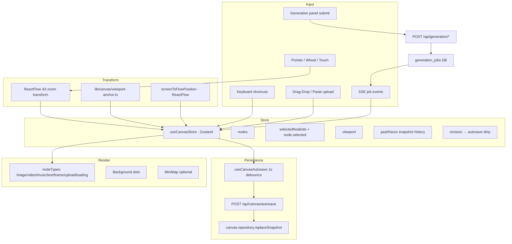
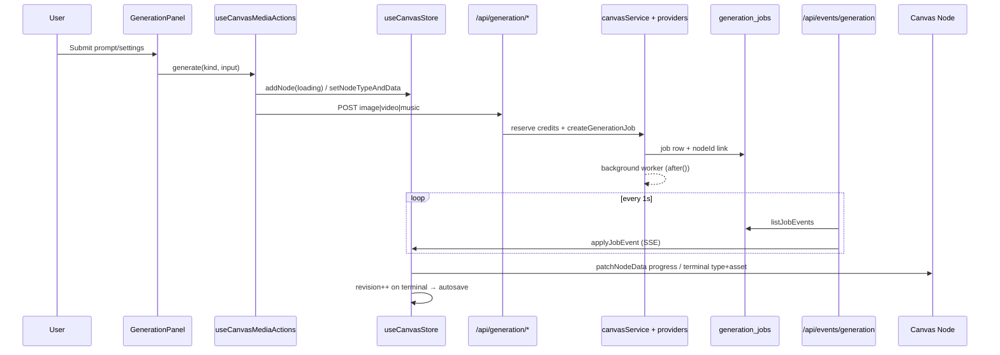

# VINCIS Infinite Canvas — 代码审计

**日期：** 2026-07-24  
**阶段：** 0（基线）+ 2（代码审计）  
**分支：** `main`（审计时点）  
**约束：** 本文档仅审计，不含业务代码修改。

---

## 阶段 0：基线

### 0.1 技术栈快照

| 层 | 实现 |
|----|------|
| 渲染 | `@xyflow/react` ^12 — DOM 节点 + Background/MiniMap |
| 客户端状态 | 单 Zustand store (`components/canvas/canvas-store.ts`) |
| 持久化 | Debounced POST `/api/canvas/autosave`（1s） |
| 生成事件 | SSE poll `/api/events/generation`（1s interval，10min 超时） |
| 服务端 | `features/canvas/*` + Prisma `canvas_nodes`, `generation_jobs` |
| 文件规模 | ~102 `components/canvas/`，~56 `lib/canvas/`，~19 `features/canvas/` |

### 0.2 架构图

### 0.3 AI 生成链路

### 0.4 性能基线（待实测）

> **说明：** 下列指标需在 `/studio/canvas/[projectId]` 用 Chrome Performance + React Profiler 实测。当前为**代码推断风险等级**，非实测 FPS。

| 场景 | 实测状态 | 代码推断 |
|------|----------|----------|
| 空画布 FPS | 待测 | 低风险 — 仅 Background |
| 20 节点 | 待测 | 中 — 无 memo，任意 node 变更触发全节点 prop 更新 |
| 100 节点 | 待测 | **高风险** — DOM 节点 + 视频/音频 decoder |
| 300+ 节点 | 待测 | **极高风险** — 超出 React Flow 舒适区 |
| 拖拽 FPS | 待测 | 中 — `onNodesChange` 每 move 更新 store；history 已 skip dragging |
| 缩放 FPS | 待测 | 低-中 — transform 由 ReactFlow 处理；`useCanvasViewportContent` 订阅 transform |
| 首次加载 | 待测 | 中 — snapshot SSR + 模型 catalog |
| 长时间内存 | 待测 | 中 — snapshot history 克隆整图；视频 preload 需查 |

**建议实测脚本（阶段 4 前）：** dev-only `performance.mark` 包装 `onNodesChange`、Profiler 录制拖拽 5s、Memory heap snapshot 对比 30min 使用。

### 0.5 视觉冻结基线（实施前必拍）

实施任何 perf/fix 前需保存截图（Desktop / iPad / Mobile）：

- 空画布、单图/视频/音乐节点、多选、生成中、失败态
- 右键（当前为 block）、缩放态、navigator dock、generation panel
- **验收：** 静态像素一致；仅允许动画更顺、延迟更低

---

## 阶段 2：文件地图

### 2.1 根组件与 Shell

| 文件 | 职责 |
|------|------|
| `app/studio/canvas/[projectId]/page.tsx` | SSR snapshot + catalog |
| `components/canvas/canvas-workspace.tsx` | 布局 shell：chat、generation、toolbar、credits |
| `components/canvas/infinite-canvas.tsx` | ReactFlow 根：nodes、viewport、shortcuts、autosave、SSE |
| `components/canvas/canvas-flow.css` | Marquee 样式、move/select cursor |

### 2.2 Viewport / Camera

| 文件 | 职责 |
|------|------|
| `hooks/use-canvas-viewport-actions.ts` | zoomIn/Out/fitView/100；rAF 同步 viewport |
| `hooks/use-canvas-viewport-content.ts` | 空画布 hint；订阅 ReactFlow transform |
| `lib/canvas/viewport-anchor.ts` | **坐标统一入口（部分）** |
| `lib/canvas/viewport-content.ts` | viewport bounds 与节点相交 |

### 2.3 事件系统

| 来源 | 行为 |
|------|------|
| ReactFlow | pan/zoom/drag/select/marquee/wheel |
| `use-canvas-shortcuts.ts` | 全局 keydown：undo/copy/zoom/layer… |
| `canvas-workspace.tsx` | **第二套** I/S/M 打开 generation panel |
| `infinite-canvas.tsx` | contextmenu block；chat image drop |
| `deleteKeyCode={null}` | Delete 由 shortcuts 处理，非 ReactFlow 内置 |

### 2.4 Store 结构（唯一 Zustand）

**文件：** `components/canvas/canvas-store.ts`

| 字段 | 说明 |
|------|------|
| `nodes`, `edges` | 图数据；**UI 强制 edges=[]** |
| `viewport` | `{ x, y, zoom }` 持久化 |
| `selectedNodeIds` | 与 `node.selected` **双源** |
| `interactionMode` | `select` \| `move` |
| `clipboardNodes` | 剪贴板 |
| `revision` | autosave 脏标记 |
| `past` / `future` | snapshot history，max 30 |

**关键 action 行为：**

| Action | History | Autosave dirty | 备注 |
|--------|---------|----------------|------|
| `onNodesChange` | 跳过 select/dragging position | 非 select 即 dirty | 每 drag move 仍 revision++ |
| `patchNodeData` | ❌ | ❌ | SSE 进度用 |
| `applyJobEvent` | 仅 terminal | 仅 terminal | |
| `setViewport` | ❌ | 仅 persist 时 | pan end 触发 |
| `undo/redo` | — | dirty | **总是 edges=[]** |

### 2.5 坐标系统

| 空间 | 实现 |
|------|------|
| Screen | 浏览器 `clientX/Y`；panel anchor 用 `flowToScreenPoint` |
| Viewport | ReactFlow container 像素 rect |
| Flow / World | ReactFlow flow coordinates；`viewportCenterFlowPoint` |
| Node local | Frame parent 相对坐标 |

**统一入口（现有）：**

- `lib/canvas/viewport-anchor.ts` — spawn、panel anchor、center
- `useReactFlow().screenToFlowPosition` — drop 落点
- ReactFlow 内部 — pan/zoom transform

**缺失：** 无单一 `screenToFlow` / `flowToScreen` 模块导出；部分组件直读 `useCanvasStore.viewport`，部分读 ReactFlow live transform → **漂移风险**。

### 2.6 历史记录

**文件：** `lib/canvas/canvas-history.ts`

- 模型：**全图 snapshot**（nodes + edges 深拷贝）
- `shouldRecordNodeHistory`：跳过 select、dimensions、**dragging position**
- 问题：drag **结束**仍可能产生多条；非 position 的连续 patch 不进 history

### 2.7 选择与框选

- Marquee：`selectionOnDrag={!isMoveMode}`
- Multi：`multiSelectionKeyCode={["Meta","Control","Shift"]}`
- Move 模式：`panOnDrag=true`，`nodesDraggable=false`
- Space + drag pan：`panActivationKeyCode="Space"`
- **无** Shift 追加框选方向规则（完全依赖 ReactFlow 默认）
- **无** 右键菜单（已 block）

### 2.8 图层

- `zIndex` on node；`reorderSelectedZIndex` forward/back/front/back
- front/back 模式：**zIndex 可无限增长**（max+1 / min-1），无压缩
- `data.hidden` / `data.locked` → `node.hidden/draggable/selectable`

### 2.9 对齐与吸附

- `alignSelectedNodes` — 对齐到 anchor 的 **y**（水平线）
- `sortSelectedNodes` — 固定 350px 间距横排
- `autoLayout` / dagre — 依赖 edges（**UI 未启用 edges**）
- **无** 网格吸附、智能参考线、缩放自适应阈值

### 2.10 生成队列与任务落点

| 环节 | 实现 |
|------|------|
| 落点 | `spawnNodeAtViewportCenter` / generation slots 堆叠 |
| Job 关联 | `node.data.jobId` + DB `generation_jobs.nodeId` |
| 进度 | SSE → `patchNodeData`（不 persist 直到 terminal） |
| 完成 | `applyGenerationJobEvent` → type 转换 + preview URL |
| SSE | **DB poll 1s**，非 push；10min 断流 |
| 幂等 | 客户端 `handledFailuresRef` 仅失败 toast；**无 job event dedupe** |

### 2.11 上传

- `useCanvasMediaActions.upload` → POST `/api/canvas/assets`
- Chat image drag → `buildChatImageCanvasNode`
- MIME/大小：服务端 validation（见 `lib/canvas/validation.ts`）
- Object URL：**组件内未发现 createObjectURL**（预览走 API URL）

### 2.12 导出

- **无整画布 export**
- 单节点：`lib/canvas/node-download.ts` → `/api/assets/download/{assetId}`
- 无多节点/区域/透明背景导出

### 2.13 持久化与恢复

- Load：`canvasService.getOrCreateSnapshot` → `initialize()`
- Save：autosave 全量 nodes/edges/viewport
- **initialize 强制 edges=[]**
- **无客户端版本冲突处理**
- 刷新后 job：SSE 重连 poll；若 job 已完成但 autosave 未写入可能 **短暂不一致**

### 2.14 渲染与性能

| 发现 | 严重度 |
|------|--------|
| **零 `React.memo`** on node components | P1 |
| `infinite-canvas` 订阅整个 `nodes` 数组 | P1 |
| `useCanvasAutosave` 依赖 `nodes` 引用 — 任意变更重置 debounce timer | P2 |
| `useCanvasViewportContent` 每次 transform 变更 `setMoveTick` → re-render | P2 |
| 视频节点 autoplay/preload 需逐组件查 | P1 |
| ReactFlow viewport culling 内置，但未禁用屏外 media | P1 |

### 2.15 重复逻辑 / 架构风险

| # | 风险 | 优先级 |
|---|------|--------|
| 1 | **双 viewport 源**：Zustand vs ReactFlow transform | P1 |
| 2 | **双 selection 源**：selectedNodeIds vs node.selected | P2 |
| 3 | **edges 死代码**：DB/autosave/undo 处理 edges，UI 永远 [] | P2 |
| 4 | **undo/redo 丢弃 edges** | P2 |
| 5 | **patchNodeData 无 persist** — 刷新丢失 loading 进度 | P1 |
| 6 | **SSE 无 event dedupe** — 重复 SUCCEEDED 可能重复 side effects | P0 |
| 7 | **autosave 无 optimistic locking** | P1 |
| 8 | **AiDirectorPanel 未挂载** — API 存在无 UI | P3 |
| 9 | **tokenBalance 双源**：workspace local state vs snapshot | P2 |
| 10 | **快捷键分散**：shortcuts + workspace I/S/M | P2 |
| 11 | **zIndex 无限增长** | P2 |
| 12 | **snapshot history 内存** — 30 × 全图 clone | P2 |

---

## 阶段 2 结论

VINCIS 画布是 **React Flow 上的 AI 媒体节点编辑器**，架构清晰、功能面较全，主要问题集中在：

1. **状态双源**（viewport、selection）
2. **渲染粒度粗**（无 memo，整数组订阅）
3. **生成事件与持久化边界**（patch vs terminal、SSE poll、幂等）
4. **edges/history 数据模型与 UI 脱节**

技术栈 **无需更换**；应在保持 UI 冻结前提下做 perf + 正确性修复。

---

*阶段 2 完成。差距清单见 `INFINITE_CANVAS_GAP_ANALYSIS.md`。*
