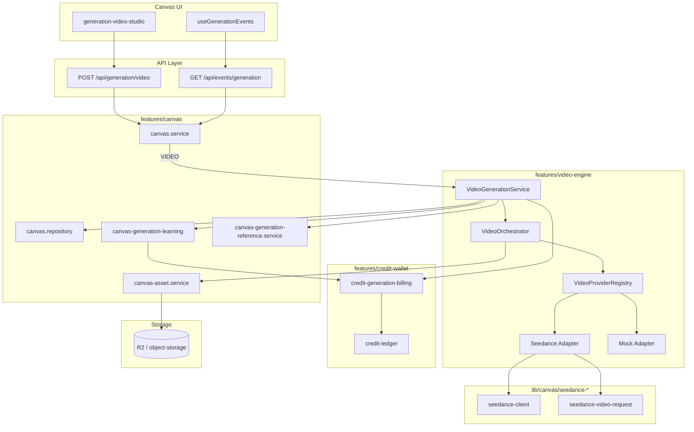

# VINCIS Video Engine — Architecture Baseline (Sprint A / B)

> **文档性质：** 基于当前代码的真实实现记录，不是目标设计。  
> **范围：** Canvas AI 视频生成（`features/video-engine/` + `generation_jobs`）。  
> **不包含：** Sprint 6 审片转码栈（`features/video/` + `video_jobs` + BullMQ + HLS）。  
> **最后对齐代码：** Sprint B 完成后的 `main`（`VideoGenerationService` / `VideoOrchestrator` / Provider Registry）。

相关文档：

- Seedance 集成细节：`docs/SEEDANCE_API_INTEGRATION_SPEC.md`（部分调用链已过时，以本文为准）
- Seedance 定价：`docs/SEEDANCE_CREDITS_PRICING.md`
- Credits 全栈：`features/credit-wallet/*`

---

## 1. 系统定位

### 1.1 VINCIS Video Engine 的职责

VINCIS Video Engine 是 **Canvas 创意工作台内的 AI 视频生成中间层**，负责：

- 接收 Canvas 用户的视频生成请求（prompt、模型、参考素材参数）
- 校验基础设施与模型可运行性
- 通过 Credits Ledger **预留 / 结算 / 释放** Token（不直接改余额）
- 选择 Provider Adapter（当前仅 Seedance 可跑）
- 编排 submit → poll → download → R2 持久化
- 更新 `generation_jobs` 状态与进度
- 终态时触发 billing sync 与 Lucien 学习记录

它 **不是** 审片 HLS 转码引擎，也 **不是** Campaign 履约视频上传流水线。

### 1.2 边界：Canvas / Video Engine / Credits / Provider / Storage

| 层 | 路径 / 模块 | 边界 |
|----|-------------|------|
| **Canvas** | `features/canvas/*`、`components/canvas/*`、`app/api/generation/*` | 项目访问、Canvas 快照、SSE 聚合、API 入口；VIDEO 类型 **委托** 给 Video Engine，不内联 Provider 调用 |
| **Video Engine** | `features/video-engine/*` | 建 job、调度 worker、编排 Provider、写 job 进度；**不** 持有 Wallet 事务逻辑 |
| **Credits** | `features/credit-wallet/*` | 唯一权威：quote、reserve、capture、release；Video Engine 只调用 `creditGenerationBillingService` / `creditLedgerService` |
| **Provider** | `features/video-engine/adapters/*`、`lib/canvas/seedance-*` | 第三方 API：submit / poll / download；错误归一化 |
| **Storage** | `features/canvas/canvas-asset.service.ts`、`lib/studioos/object-storage.ts` | R2（或本地回退）写入；Asset 行 + `outputAssetId` 关联 job |

### 1.3 与 `features/video` 审片 / HLS 模块的区别

项目中存在 **两套「Video Job」**，禁止混用：

```
┌──────────────────────────────────────────────────────────────────┐
│ features/video/  —  Sprint 6 审片 / 履约视频                      │
│   表: video_jobs, campaign_versions                             │
│   队列: BullMQ (npm run worker:video)                           │
│   能力: 分片上传、FFmpeg 720p HLS、Signed URL、水印、审片播放       │
└──────────────────────────────────────────────────────────────────┘

┌──────────────────────────────────────────────────────────────────┐
│ features/video-engine/  —  Canvas AI 视频生成（本文档）            │
│   表: generation_jobs (type = VIDEO)                              │
│   队列: scheduleCanvasBackgroundWork (Next.js after / microtask)  │
│   能力: Seedance API → 下载 → R2 → Canvas 节点预览                │
└──────────────────────────────────────────────────────────────────┘
```

---

## 2. 当前真实调用链

### 2.1 主路径（VIDEO）

```
POST /api/generation/video
  │  app/api/generation/video/route.ts
  │  Zod: videoGenerationSchema (prompt ≤ 5000)
  ▼
canvasService.createMockGeneration({ type: "VIDEO", ... }, user)
  │  features/canvas/canvas.service.ts — VIDEO 分支早退
  ▼
VideoGenerationService.createJob(input, user)
  │  features/video-engine/video-generation.service.ts
  │  · assertVideoGenerationInfrastructure(model)
  │  · normalizeGenerationReferenceParameters (referenceNodeId → assetId)
  │  · aiModelGenerationGuard.resolveForGeneration
  │  · creditGenerationBillingService.reserveForGeneration
  │  · resolveVideoProviderId → "seedance" | "vincis-mock"
  │  · canvasRepository.createGenerationJob (idempotent upsert)
  │  · creditLedgerService.linkReservationToJob
  │  · scheduleJob → scheduleCanvasBackgroundWork
  ▼
VideoGenerationService.processJob(jobId, ownerId)   [异步 worker]
  │  · authService.getUserById
  │  · canvasRepository.claimGenerationJob (QUEUED|SUBMITTING → PROCESSING)
  ▼
VideoOrchestrator.runJob(user, job, ctx)
  │  features/video-engine/video-orchestrator.ts
  │  · getVideoProviderAdapter(job.provider)
  │  · adapter.submit → adapter.poll → adapter.download
  │  · ctx.storage.saveGeneratedVideo → canvasAssetService.saveGeneratedVideoBuffer
  │  · ctx.progress.mark* → canvasRepository.updateGenerationJob
  ▼
finalizeCanvasGenerationJob(user, jobId, ownerId)   [finally]
  │  features/canvas/canvas-generation-learning.ts
  │  · creditGenerationBillingService.syncJobBilling (CAPTURE | RELEASE)
  │  · recordCanvasGenerationLucienLearning
  ▼
SSE GET /api/events/generation?projectId=...
  │  canvasService.listJobEvents → getJob (含 kickStale + billing 展示字段)
  ▼
Canvas UI: useGenerationEvents → applyJobEvent → 节点 progress / assetId
```

### 2.2 并行 / 辅助路径

| 路径 | 说明 |
|------|------|
| `GET /api/generation/[jobId]` | 单 job 轮询；客户端主要用 SSE |
| `GET /api/v1/credits/quote` | 预报价（UI Token 展示） |
| `POST /api/v1/webhooks/seedance` | **仅 log**，不更新 job、不结算 |
| `kickStaleVideoJob` | `getJob` / SSE 时若 Seedance job 在 QUEUED/SUBMITTING 超过 1.5s 则重调度 worker |

### 2.3 调度机制

```typescript
// lib/canvas/schedule-background-work.ts
// dev:  queueMicrotask
// prod: Next.js after()
scheduleCanvasBackgroundWork("VideoGenerationService.processJob", () => processJob(...))
```

**不是** BullMQ；与 `features/video/video-queue.service.ts` 无关。

---

## 3. 模块职责

### 3.1 `video-generation.service.ts`

**入口 Service（Sprint B 核心）。**

| 方法 | 职责 |
|------|------|
| `createJob` | 权限 / 参考素材规范化 / 模型 guard / **reserve credits** / 写 `generation_jobs` / schedule worker / activity log |
| `scheduleJob` | 通过 `scheduleCanvasBackgroundWork` 异步触发 `processJob` |
| `processJob` | claim job → 构造 `VideoOrchestratorJob` → 调用 orchestrator → `finally` 里 `finalizeCanvasGenerationJob` |
| `kickStaleJob` | 仅 `provider === "seedance"` 且 QUEUED/SUBMITTING 且 created > 1.5s 时重调度 |

内部 `abortVideoGenerationJob`：schedule 失败时 mark FAILED + `finalizeFailure`。

### 3.2 `video-orchestrator.ts`

**纯编排，无 DB/Credits 直接访问。**

流程：`isAvailable` → `submit` → `poll` → `download` → `ctx.storage.saveGeneratedVideo` → `markSucceeded` / `markFailed`。

Storage metadata 写入 Seedance taskId、generationType、providerCredits 等供对账。

### 3.3 `video-generation.types.ts`

- `VideoGenerationCreateInput` / `VideoGenerationCreateResult` — createJob 契约
- `VideoOrchestratorJob` — worker 内存 job 视图
- `VideoOrchestratorContext` — **端口**：`progress` + `storage` writer（便于测试与未来替换）

### 3.4 `video-infrastructure.ts`

`assertVideoGenerationInfrastructure(modelId)`：

- 非 Seedance 模型：直接 return（不检查 Key）
- Seedance 模型：要求 `hasSeedance()` +（R2 已配置 **或** `canPersistLocalDataStore()`）

### 3.5 `video-provider.registry.ts`

| 函数 | 行为 |
|------|------|
| `resolveVideoProviderId(provider, modelId)` | 有 Seedance Key 且模型/提供商标识为 Seedance → `"seedance"`，否则 `"vincis-mock"` |
| `getVideoProviderAdapter(providerId)` | `"seedance"` → seedance adapter；其他 → mock adapter |
| `listVideoProviderAdapters()` | 返回两个 adapter 实例 |

### 3.6 Seedance Adapter — `adapters/seedance-video.adapter.ts`

实现 `VideoProviderAdapter`；内部委托：

- `submit` → `lib/canvas/seedance-video-request.ts` → `seedanceCreateVideoTask`
- `poll` → `lib/canvas/seedance-client.ts` → `seedancePollTask`（默认 10s 间隔，15min 超时）
- `download` → `seedanceDownloadVideo`
- `normalizeError` → `SeedanceApiError.code` 或 `SEEDANCE_GENERATION_FAILED`

### 3.7 Mock Adapter — `adapters/mock-video.adapter.ts`

**当前不是可用的 Mock 生成器。**

- `isAvailable()` → **`false`**
- `submit` / `poll` / `download` → throw
- `unavailableError()` → `SEEDANCE_NOT_CONFIGURED`（与无 Key 时相同文案）

当 `resolveVideoProviderId` 返回 `"vincis-mock"` 时，orchestrator 在第一步即 `markFailed`，不会生成视频。

### 3.8 Deprecated — `canvas-video-generation.service.ts`

```typescript
/** @deprecated Prefer videoGenerationService from features/video-engine. */
export class CanvasVideoGenerationService {
  scheduleJob(...) { videoGenerationService.scheduleJob(...); }
  processJob(...) { return videoGenerationService.processJob(...); }
}
```

**无任何其他引用**；保留供旧文档 / 外部脚本兼容，可转发到新 Engine。

### 3.9 相关 Canvas 模块（非 video-engine 但属调用链）

| 模块 | 职责 |
|------|------|
| `canvas-generation-reference.service.ts` | `referenceNodeId` / preview URL → `referenceAssetId` + mime |
| `canvas-generation-learning.ts` | 终态 billing + Lucien |
| `canvas.repository.ts` | `generation_jobs` CRUD、`claimGenerationJob` |
| `canvas-asset.service.ts` | `saveGeneratedVideoBuffer` → R2 + Asset 行 |
| `ai-model-generation.guard.ts` | 模型解析、定价规则、参数校验 |

---

## 4. 依赖方向

### 4.1 允许

```
app/api/generation/*
  → features/canvas/canvas.service
  → features/video-engine/video-generation.service
  → features/video-engine/video-orchestrator
  → features/video-engine/video-provider.registry
  → features/video-engine/adapters/*
  → lib/canvas/seedance-*          (Provider HTTP 实现)
  → features/canvas/canvas.repository
  → features/canvas/canvas-asset.service
  → features/credit-wallet/*
  → features/canvas/canvas-generation-learning
```

```
components/canvas/*
  → app/api/* only (禁止 import video-engine / seedance-client)
```

### 4.2 禁止

| 禁止 | 原因 |
|------|------|
| `video-engine` → `components/*` | 分层 |
| `video-orchestrator` → `credit-wallet` 直接改余额 | Credits 语义集中 |
| `adapters/*` → `canvas.repository` | Adapter 只做 Provider I/O |
| `features/video/*` ↔ `features/video-engine/*` 互依赖 | 两域隔离 |
| Page / 组件 → `prisma` / Provider HTTP | Feature First + 分层 |
| Video Engine → 绕过 Ledger 改 `creditWallet.availableCredits` | 双账本规则 |

### 4.3 共享 lib 例外

`lib/canvas/seedance-*` 当前被 Adapter 使用；Sprint C/D 不应把业务逻辑继续堆进 lib，新 Provider 应走 `adapters/` + registry。

---

## 5. Credits 生命周期

### 5.1 时序

```
createJob
  └─ creditGenerationBillingService.reserveForGeneration
       └─ creditLedgerService.reserveCredits
            · wallet.availableCredits -= amount
            · wallet.reservedCredits += amount
            · CreditReservation.status = ACTIVE
            · CreditTransaction.type = RESERVE

processJob 成功 (status = SUCCEEDED)
  └─ finalizeCanvasGenerationJob
       └─ syncJobBilling → captureReservation(actualCredits)
            · actualCredits 默认 = estimatedCredits（orchestrator 未做动态调价）
            · reserved → lifetimeSpent；差额 release 回 available

processJob 失败 (status = FAILED | CANCELLED)
  └─ finalizeCanvasGenerationJob
       └─ syncJobBilling → releaseReservation
            · reserved 全额回到 available

schedule 失败 (createJob 内 catch)
  └─ abortVideoGenerationJob → finalizeFailure (立即 release)
```

### 5.2 Video Engine 约束

- **不得** 调用 `creditWalletRepository` 直接改余额
- **不得** 新增 bypass Ledger 的扣费路径
- 权威扣费金额来自 job 创建时的 `estimatedCredits` / pricing snapshot

### 5.3 失败与重试

| 场景 | Credits | Job |
|------|---------|-----|
| Provider 失败 | `finalize` → RELEASE | FAILED + errorCode |
| Worker crash（进程被杀） | reservation 可能长时间 ACTIVE | QUEUED/PROCESSING 卡住；`kickStaleJob` 仅重调度 **Seedance** 且 QUEUED/SUBMITTING |
| 重复 idempotencyKey | 返回已有 job，不二次 reserve | upsert `update: {}` |
| SSE 轮询 | `getJob` 内也会调 `syncJobBilling`（终态幂等） | — |

**无** Attempt 级部分 capture；**无** 自动 retry 同一 job。

### 5.4 idempotency

- Job：`@@unique([ownerId, idempotencyKey])`
- Reservation：`idempotencyKey` 在 ledger 层去重

---

## 6. Job 生命周期（当前实际）

### 6.1 状态枚举（Prisma `GenerationStatus`）

```
QUEUED | SUBMITTING | PROCESSING | SUCCEEDED | FAILED | CANCELLED
```

### 6.2 VIDEO 实际流转

```
                    createGenerationJob
                           │
                           ▼
                        QUEUED
                           │
              claimGenerationJob (worker)
                           │
                           ▼
                      PROCESSING ─────────────────┐
                           │                      │
              submit OK (progress 25)             │
              poll progress (25–~85)              │
              poll complete (88)                  │
              save R2 + markSucceeded (100)       │ markFailed (100)
                           │                      │
                           ▼                      ▼
                      SUCCEEDED               FAILED
```

**说明：**

- **`SUBMITTING`**：枚举存在、`claimGenerationJob` 接受，但 **当前 VIDEO 代码从不写入 SUBMITTING**（创建后即为 QUEUED）。
- **`CANCELLED`**：枚举存在，**无 cancel API / worker 路径**。
- **Progress 锚点**：claim 15 → submit 25 → Seedance status 映射 → poll 完成 88 → 成功 100。

### 6.3 持久化字段（`generation_jobs`）

关键列：`provider`、`model`、`providerTaskId`、`outputAssetId`、`creditReservationId`、`pricingSnapshot`、`errorCode`、`errorMessage`。

**无** 独立 event 表；状态变更 **仅** 更新 job 行。

---

## 7. Provider Adapter 规范

### 7.1 当前接口 — `video-provider.types.ts`

```typescript
interface VideoProviderAdapter {
  readonly id: VideoProviderId;  // "seedance" | "vincis-mock"
  isAvailable(): boolean;
  submit(input: VideoGenerationSubmitInput): Promise<VideoGenerationSubmitResult>;
  poll(input: { taskId; onProgress? }): Promise<VideoGenerationPollResult>;
  download(videoUrl: string): Promise<VideoDownloadResult>;
  normalizeError(error: unknown): VideoProviderError;
  unavailableError(): VideoProviderError;
}
```

### 7.2 Seedance 实现

| 项 | 实现 |
|----|------|
| 可用条件 | `SEEDANCE_API_KEY` 已配置 |
| 模型映射 | `seedance-2.0*` → API `seedance-2-0*`（见 `seedance-client.ts`） |
| 生成模式 | `text-to-video` / `image-to-video` / `reference-to-video`（`seedance-video-request.ts`） |
| 参考素材 | Canvas asset → presigned HTTPS URL（`seedance-public-asset-url.ts`） |
| 轮询 | 主路径；非 webhook |
| callbackUrl | 可传给 API（`SEEDANCE_CALLBACK_URL`），**webhook 不驱动结算** |

### 7.3 Mock 实现

占位 Adapter：**永远不可用**，用于 registry  fallback 分支，**不能** 用于本地 demo 生成。

### 7.4 Kling / Veo 当前状态

| Provider | DB / UI 目录 | Adapter | 可运行 |
|----------|--------------|---------|--------|
| Kling | `ai-model-catalog-fallback.ts` 占位 | ❌ | ❌ `isRunnableCanvasAiModel` 过滤 |
| Veo | 同上 | ❌ | ❌ |
| Seedance | ✅ | ✅ | ✅ 需 Key + Storage |

### 7.5 新增 Provider 标准步骤（Sprint C 之前的手动清单）

1. 在 `video-provider.types.ts` 扩展 `VideoProviderId`
2. 新建 `adapters/<provider>-video.adapter.ts` 实现 `VideoProviderAdapter`
3. 注册到 `video-provider.registry.ts` 的 `ADAPTERS` + `resolveVideoProviderId` 路由规则
4. 添加 `lib/canvas/<provider>-client.ts` + request builder（HTTP 层）
5. 更新 `canvas-runnable-models.ts` + `credit_pricing_rules` / `ai_models`
6. **禁止** 在 `canvas.service` 或 UI 内联 Provider 调用
7. 通过 `npm run typecheck && npm run build && npm run production:verify` 验收

---

## 8. Storage 流程

```
Provider 返回临时 videoUrl (HTTPS)
  │
  ▼
adapter.download(url)
  · fetch → Buffer
  · 校验非空；Content-Type → mimeType (mp4/webm/quicktime)
  │
  ▼
canvasAssetService.saveGeneratedVideoBuffer(projectId, user, { buffer, mimeType, fileName, metadata })
  · 校验 ≤ 200MB
  · putObject → R2 key:
      campaigns/{campaignId}/canvas/{uuid}.mp4
      或 creative-projects/{projectId}/canvas/{uuid}.mp4
  · 写 CampaignAsset 或 CreativeProjectAsset (assetType: REFERENCE_VIDEO)
  · metadataJson: prompt, model, seedanceTaskId, generationJobId, nodeId, ...
  │
  ▼
generation_jobs.outputAssetId = asset.id
Canvas preview: GET /api/canvas/assets/{id}/preview
```

**原则：** 不依赖 Provider 临时 URL 作为长期资产；下载后立即持久化到 R2。

**缺口：** `outputAssetId` **无 FK** 指向 asset 表；删除 asset 不会级联 job。

---

## 9. 向后兼容策略

### 9.1 保持不变

| 项 | 状态 |
|----|------|
| `POST /api/generation/video` | ✅ 路径与 body 形状不变 |
| `GET /api/events/generation` | ✅ SSE 1s 轮询 |
| `GET /api/generation/[jobId]` | ✅ |
| Canvas UI 组件 | ✅ 仍调上述 API |
| `createMockGeneration` 函数名 | ✅ 保留（IMAGE/MUSIC 仍走原逻辑） |
| Credits 语义 | ✅ reserve / capture / release 不变 |

### 9.2 Deprecated 转发层

- `features/canvas/canvas-video-generation.service.ts` → 转发 `videoGenerationService`
- `features/canvas/providers/provider.types.ts` 内 `VideoProvider` → 标记 deprecated，零实现

### 9.3 后续删除条件

可在 **同时满足** 以下条件后删除 deprecated 层：

1. 代码库内无 `canvasVideoGenerationService` 引用（当前已满足）
2. 外部 runbook / 文档已改为 `videoGenerationService`
3. Sprint C+ 稳定运行 ≥ 1 个发布周期
4. `docs/SEEDANCE_API_INTEGRATION_SPEC.md` 调用链已更新

**Sprint C 明确禁止** 删除旧 API 或 deprecated 转发层。

---

## 10. 已知限制

| 限制 | 现状 |
|------|------|
| **无 DB `GenerationJobEvent` 表** | SSE 用的 `GenerationJobEvent` 仅是 `lib/canvas/types.ts` 的 **DTO 类型**，不是持久化事件 |
| **无 `GenerationJobAttempt`** | 单次 worker 运行无 attempt 行；无法审计 retry |
| **无 `VideoRoutingDecision`** | 路由仅 `resolveVideoProviderId` 硬编码 Seedance/mock |
| **无 `VideoPromptVersion`** | prompt 只存在 `generation_jobs.prompt` |
| **无完整崩溃恢复** | mid-poll 进程死亡可能留 ACTIVE reservation；仅 `kickStaleJob` 弱恢复 |
| **Webhook 未接入结算** | `POST /api/v1/webhooks/seedance` 只 log；主路径 polling |
| **Kling / Veo 未实现** | 目录占位，服务端过滤不可运行 |
| **Mock Adapter 不可用** | `isAvailable() === false`，非测试 Mock |
| **`SUBMITTING` 未使用** | 枚举预留，VIDEO 流程未写入 |
| **`cameraMovements` 未映射** | API/UI 接受参数，**不** 传入 Seedance body |
| **`provider_task_id` 无索引** | Webhook 查找 `findGenerationJobByProviderTaskId` 可能全表扫描 |
| **无专用 automated test** | 无 `features/video-engine/**/*.test.ts` |
| **SSE 性能** | 1Hz × N jobs × `syncJobBilling` 查询 |

---

## 11. Sprint C 边界

### 11.1 Sprint C 只允许新增

| 交付物 | 说明 |
|--------|------|
| **`GenerationJobEvent`**（DB 表） | 持久化状态迁移审计；**注意** 与 `lib/canvas/types.ts` SSE DTO 同名，实现时需 namespace 或 rename 避免混淆 |
| **`GenerationJobAttempt`** | 每次 worker 执行一条（submit/poll/download 阶段） |
| **`VideoRoutingDecision`** | 记录 provider/model 选择依据（为 Sprint D Router 预留） |
| **`VideoPromptVersion`** | 原始 prompt + 版本链（为 Sprint D Enhancer 预留） |
| **必要索引与唯一约束** | 至少：`generation_jobs.provider_task_id`；event/attempt 外键 + `(job_id, created_at)` |

Sprint C **只加表与写入**，不改变现有 7 态主流程语义。

### 11.2 Sprint C 不允许

- 修改 Canvas UI
- 修改 Credits reserve/capture/release 业务语义
- 重写 Provider Adapter（Seedance 行为等价迁移除外的小改）
- 引入 Prompt Enhancer / Shot Planner / AI Quality Scoring
- 删除 `POST /api/generation/video`
- 删除 `canvas-video-generation.service.ts` 转发层

---

## 12. Sprint D 边界 — Creative Intelligence Layer

> **完整设计：** `docs/VINCIS_DIRECTOR.md`（Owner 拍板 · 只设计不写代码）。  
> **实施顺序：** Creator-1 稳定后再做 Sprint D **代码**；Director 代码不属于 v1.0。

Sprint D 位于 **Video Engine 上游**，不嵌入 Orchestrator 内部：

```
User
  → Creative Planner
  → Prompt Enhancer
  → Shot Planner
  → Model Router
  → Video Engine (VideoGenerationService / Orchestrator)
  → Provider Adapter
```

Sprint D 产出应作为 `createJob` **之前** 或 **Orchestrator 之前** 的 pipeline，输出写入 `VideoPromptVersion` / `VideoRoutingDecision`，再进入现有 reserve → worker 路径。

Sprint D **仍不得** 修改 Credits 语义或直接写 Wallet。

---

## 13. 回滚策略

> 当前 **无** Feature Flag；回滚靠配置 + Git。

### 13.1 关闭新 Video Engine（运行时）

| 手段 | 效果 |
|------|------|
| 移除 `SEEDANCE_API_KEY` | Seedance 模型在 `createJob` 前被 infrastructure 拒绝；非 Seedance 模型走 mock adapter → 立即 FAILED + release |
| 移除 R2 配置（且无 local persist） | Seedance 模型 createJob 失败 |

### 13.2 恢复旧 Canvas 转发路径（代码级）

1. Git revert Sprint B commit（`VideoGenerationService` 提取之前的版本）
2. 或：将 `canvas.service` VIDEO 分支改回内联 worker（**不推荐**；deprecated shim 已指向新 service）

`canvas-video-generation.service.ts` 已是薄转发；revert 后只需恢复 `canvas.service` 直接调用 shim 或内联逻辑。

### 13.3 保证现有任务不丢失

- Job 数据在 `generation_jobs`；回滚代码 **不得** truncate 该表
- 进行中的 job：revert 后若 worker 不再运行，依赖 revert 版本中的 `kickStale*` 逻辑或手动 `scheduleJob`
- ACTIVE reservation：终态 job 必须跑 `finalizeCanvasGenerationJob`；卡住的 job 需 ops 脚本调用 `syncJobBilling` 或 admin release（无自动化 reaper）

---

## 14. 验收清单（Sprint A / B 基线）

| 检查 | 命令 / 方法 | Sprint A/B 状态 |
|------|-------------|-----------------|
| Typecheck | `npm run typecheck` | ✅ 必须通过 |
| Build | `npm run build` | ✅ 必须通过 |
| Production gates | `npm run production:verify` | ✅ 必须通过 |
| Unit / integration tests | `npm run test` | ⚠️ 无 video-engine 专用用例 |
| Seedance 真实生成 | 配置 Key + R2；Canvas 提交 VIDEO job | ✅ 主路径 |
| Mock 生成 | `vincis-mock` adapter | ❌ **不可用**（by design 当前） |
| Credits reserve | 创建 job 后 reservation ACTIVE | ✅ |
| Credits capture | SUCCEEDED 后 CAPTURED | ✅ |
| Credits release | FAILED 后 RELEASED | ✅ |
| R2 存储 | `outputAssetId` + preview URL | ✅ |
| SSE 状态 | `/api/events/generation` 进度更新 | ✅ |
| 旧 API 兼容 | `POST /api/generation/video` 202 + 同 shape | ✅ |

Seedance 状态探测：`GET /api/v1/seedance/status`

---

## 附录 A — 架构图（当前实现）



---

## 附录 B — 已实现 vs 未实现

### 已实现（Sprint A / B）

- `VideoProviderAdapter` 接口 + Registry
- `SeedanceVideoAdapter`（submit / poll / download / error normalize）
- `VideoGenerationService` + `VideoOrchestrator` 分层
- Canvas VIDEO 委托路径
- Credits reserve / capture / release（Ledger）
- R2 持久化 + Asset 关联
- SSE 进度推送
- 参考素材 nodeId → assetId 规范化
- Lucien 学习（成功 / 失败）
- `kickStaleJob` 弱恢复
- Deprecated 转发层

### 已实现（Sprint C — 2026-07-24）

- `generation_job_events` / `generation_job_attempts` / `video_routing_decisions` / `video_prompt_versions`
- `createGenerationJob` 幂等：`create` + P2002 → 查现有 job（非 upsert / 非 find-then-create）
- `claimVideoGenerationJobWithAttempt`：claim + attempt + `JOB_CLAIMED` 同一 transaction
- `videoJobAuditService` 分级写入：普通 event best-effort；Attempt / PromptVersion / RoutingDecision / JOB_CREATED / JOB_SUCCEEDED / JOB_FAILED 失败 emit `VIDEO_ENGINE_AUDIT_WRITE_FAILED`
- `resolveVideoProviderRouting`：生产无 Mock fallback；失败原因 `SEEDANCE_NOT_CONFIGURED` / `PROVIDER_UNAVAILABLE` / `UNSUPPORTED_MODEL`
- `providerPrompt` 在 Adapter submit 前写入 PromptVersion v1
- Mock：`NODE_ENV=production` 绝对 unavailable；test 通过 Registry DI
- 验收：`npm run video-engine:sprint-c:verify`

### 未实现

- Kling / Veo Adapter
- Webhook 驱动 job 完成与结算
- BullMQ / 独立 worker 进程（Canvas 视频域）
- Cancel / Retry API
- Prompt Enhancer / Shot Planner / Model Router / Quality Scoring
- 完整 crash recovery + reservation reaper
- `cameraMovements` → Provider 映射
- Video Engine 管理后台
- `/api/v1/video-generations` 资源型 API

---

## 附录 C — Sprint C 精确迁移计划

> **状态：** ✅ 已实施（2026-07-24）。以下保留为迁移与验收记录。

> **前提：** 本文档已冻结 A/B 基线；Sprint C **仅** 数据库 + 写入逻辑，不改 UI / Credits 语义 / Adapter 行为。

### C.0 目标

为每次 job 运行留下 **可审计、可恢复、可路由分析** 的最小数据面，供 Sprint D Intelligence Layer 与 ops 使用。

### C.0.1 Owner 硬性约束（实施时必须遵守）

1. Job 幂等创建依赖 DB unique `(owner_id, idempotency_key)`：`create` → P2002 → `findUniqueOrThrow`
2. Job claim 与 Attempt 创建 + `JOB_CLAIMED` 同一 Prisma transaction；Attempt 失败不得继续 Provider
3. 核心审计失败不回滚 Credits/Provider，但必须 `VIDEO_ENGINE_AUDIT_WRITE_FAILED` 结构化 error
4. Mock Provider 生产绝对不可用；`VIDEO_ENGINE_MOCK_PROVIDER` 仅 development
5. RoutingDecision 不得记录 mock fallback 为正常 selectedProvider
6. `providerPrompt` 在 Adapter 真正 submit 前更新（创建 Job 时 `providerPrompt=null`）

### C.1 Prisma 迁移（ADD ONLY）

#### `generation_job_events`

| 列 | 类型 | 说明 |
|----|------|------|
| id | UUID PK | |
| generation_job_id | UUID FK → generation_jobs | ON DELETE CASCADE |
| event_type | TEXT | 例：`JOB_CREATED`, `CLAIMED`, `PROVIDER_SUBMITTED`, `PROVIDER_POLL`, `STORAGE_SAVED`, `SUCCEEDED`, `FAILED` |
| from_status | GenerationStatus? | |
| to_status | GenerationStatus? | |
| progress | INT? | |
| payload | JSONB? | 脱敏 provider 摘要 |
| created_at | TIMESTAMPTZ | |

索引：`(generation_job_id, created_at)`。

#### `generation_job_attempts`

| 列 | 类型 | 说明 |
|----|------|------|
| id | UUID PK | |
| generation_job_id | UUID FK | |
| attempt_number | INT | UNIQUE(generation_job_id, attempt_number) |
| provider | TEXT | |
| provider_task_id | TEXT? | |
| status | TEXT | `RUNNING` / `SUCCEEDED` / `FAILED` |
| error_code | TEXT? | |
| started_at / finished_at | TIMESTAMPTZ | |

索引：`(provider_task_id)`。

#### `video_routing_decisions`

| 列 | 类型 | 说明 |
|----|------|------|
| id | UUID PK | |
| generation_job_id | UUID FK UNIQUE | 一 job 一条（Sprint C） |
| requested_model | TEXT | |
| resolved_provider | TEXT | |
| resolved_model | TEXT | |
| reason | TEXT | 例：`SEEDANCE_CONFIGURED`, `SEEDANCE_NOT_CONFIGURED`, `PROVIDER_UNAVAILABLE` |
| metadata | JSONB? | |
| created_at | TIMESTAMPTZ | |

#### `video_prompt_versions`

| 列 | 类型 | 说明 |
|----|------|------|
| id | UUID PK | |
| generation_job_id | UUID FK | |
| version | INT | UNIQUE(generation_job_id, version) |
| source | TEXT | `USER`（Sprint C 仅此项） |
| prompt | TEXT | 用户原始 prompt |
| provider_prompt | TEXT? | **Adapter submit 前** 写入；创建 Job 时为 null |
| created_at | TIMESTAMPTZ | |

#### 索引补丁（同迁移）

```sql
CREATE INDEX generation_jobs_provider_task_id_idx ON generation_jobs (provider_task_id);
```

### C.2 代码写入点（Sprint C 已实现）

| 模块 | 职责 |
|------|------|
| `features/video-engine/video-job-audit.repository.ts` | 审计表 CRUD |
| `features/video-engine/video-job-audit.service.ts` | 分级 audit 写入 + `VIDEO_ENGINE_AUDIT_WRITE_FAILED` |
| `features/video-engine/video-job-claim.repository.ts` | claim + attempt + JOB_CLAIMED 事务 |
| `features/canvas/canvas.repository.ts` | `createGenerationJob` 幂等 create |
| `features/video-engine/video-generation.service.ts` | create 后写 JOB_CREATED / routing / prompt v1 |
| `features/video-engine/video-orchestrator.ts` | submit 前 providerPrompt；执行期 events |

| 时机 | 写入 |
|------|------|
| `createJob` 成功后（`created=true`） | `JOB_CREATED`；`video_prompt_versions` v1（providerPrompt null）；`video_routing_decisions` |
| `claimGenerationJobWithAttempt` | 同事务：`generation_job_attempts` + `JOB_CLAIMED` |
| orchestrator submit 前 | 更新 PromptVersion.providerPrompt |
| orchestrator submit / poll / save | attempt 更新 + best-effort events |
| 终态 | `JOB_SUCCEEDED` / `JOB_FAILED`（required audit） |

### C.3 数据回填

- 历史 job：可选 batch 脚本插入一条 `BACKFILL` event（非必须）
- 不修改历史 reservation / billing

### C.4 Sprint C 验收

1. `npm run db:migrate:deploy` 或 migrate 成功
2. `npm run typecheck && npm run build && npm run production:verify`
3. `npm run video-engine:sprint-c:verify`
4. 新 VIDEO job 在 DB 可查到 events + attempt + routing + prompt version
5. Seedance 端到端行为与 Sprint B 一致（回归）
6. Credits 流水与 Sprint B 一致

**Migration 风险：** ADD ONLY；历史 job 无 audit 行（可选 backfill 脚本，非必须）。未 migrate 时 claim 事务失败 → job 标记 FAILED（需先 deploy migration）。

**已知限制：** audit 表不对 UI/SSE 暴露；Webhook 仍只 log；Mock 生产不可用。

### C.5 Sprint C 明确不做

见 §11.2。

---

## 附录 D — 文档与代码不一致项（维护时注意）

| 文档 | 过时描述 | 正确来源 |
|------|----------|----------|
| `docs/SEEDANCE_API_INTEGRATION_SPEC.md` §2 | `canvasVideoGenerationService.processJob()` | `videoGenerationService.processJob()` |
| 同上 §6 | worker 文件路径 | `features/video-engine/video-generation.service.ts` |
| 阶段 0 审计 | 「无 VideoProviderRegistry」 | Sprint A 已实现 |

更新 Seedance spec 时 **只改调用链章节**，Pricing 章节仍有效。

---

*本文档为 Sprint C 启动前的架构基准。任何偏离须先更新本文档并获 owner 确认。*
