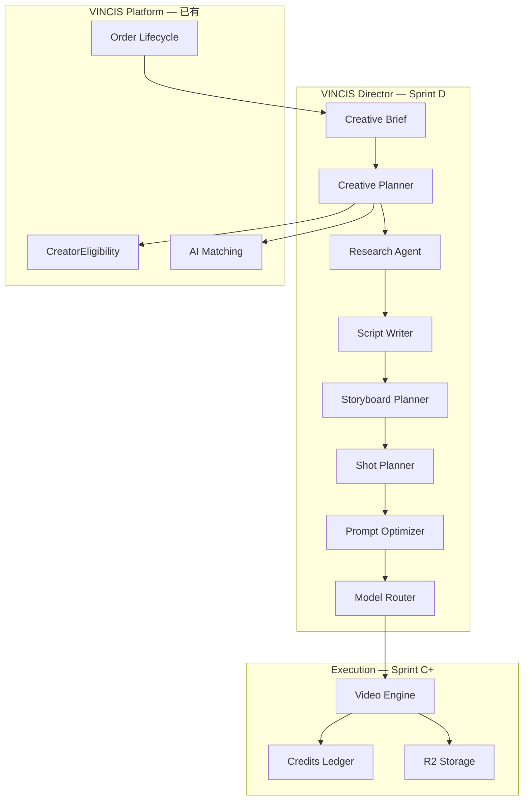

# VINCIS Director — Creative Intelligence Spec (Sprint D)

> **文档性质：** VINCIS 创意智能层（Creative Intelligence Layer）的正式**设计规范**。  
> **状态：** Owner 拍板 · **只设计，不写代码**（Sprint D 文档阶段）。  
> **实施顺序：** Sprint C ✅ → **本文档** → **Creator-1 实现** → **Sprint D 代码**  
> **v1.0 边界：** 本文档可先行；**Director 代码不属于 v1.0**，属 v1.1+。  
> **最后更新：** 2026-07-24

相关文档：

- Creator 权限真相：`docs/CREATOR_LIFECYCLE_SPEC.md`（Director 依赖 `CreatorEligibility`）
- 订单 / 邀约闭环：`docs/VINCIS_ORDER_LIFECYCLE_SPEC.md`
- Video Engine（下游执行层）：`docs/VIDEO_ENGINE.md`
- AI 偏好 / 学习：`docs/AI_PREFERENCE_ENGINE.md`、`docs/AI_LEARNING_FOUNDATION.md`

---

## 1. 产品愿景

### 1.1 用户看到的是什么

**不是 Seedance。**  
**不是「Prompt 增强器」。**

用户看到的是 **VINCIS Director** — 品牌方的 AI 创意总监：

```text
品牌：「我要拍一个宝马广告」

Director：
  → 理解意图
  → 追问澄清（预算感、时长、平台、调性）
  → 产出 Creative Brief
  → 拆 Research / Script / Storyboard / Shot List
  → 优化 Provider Prompt
  → 路由模型（Seedance 只是 Provider 之一）
  → 调用 Video Engine 生成
  → Quality Review + Learning
```

对外品牌：**Powered by VINCIS Director**  
Seedance / 未来 Kling / Veo = **Provider**，不是产品名。

### 1.2 与现有系统的关系



---

## 2. 为什么 Creator-1 必须先于 Director 代码

Director 会触达：

| 能力 | 若无非 Creator-1 权限层 |
|------|-------------------------|
| AI 推荐 Creator | 可能推荐未审核 / 暂停接单 / Vacation 创作者 |
| AI 自动匹配 | 与 `matching.service` 语义不一致 |
| AI Project Brief → 邀约 | 邀约发给无资格 Creator |
| Workflow 排期 | 忽略 Availability / BOOKED |

**结论：** `CreatorEligibilityService`（`docs/CREATOR_LIFECYCLE_SPEC.md` §3）是 Director 的**基础设施**。  
Sprint D **文档**可并行；Sprint D **代码**必须在 Creator-1 稳定 + `creator.lifecycle.enforcement` 可灰度之后。

Director 内所有 Creator 相关步骤 **必须** 调用：

```typescript
resolveCreatorEligibility(profile, legacy, enforcementEnabled)
// 使用 canReceiveInvitations / canAppearInMarketplace / canSubmitProposal
// 禁止自行拼装 verificationStatus
```

---

## 3. v1.0 vs v1.1 边界

| 范围 | v1.0 | v1.1+ (Director 代码) |
|------|------|-------------------------|
| Director Agent 链 | ❌ | ✅ |
| Canvas 直接 Seedance 生成 | ✅ | ✅（经 Director 可选包装） |
| Creator 审核 + Eligibility | ✅ Creator-1 | ✅ |
| Reputation 排序 | ❌ Creator-2 | ✅ |
| 多 Provider 路由 | ❌ | ✅ Model Router |
| Quality Review 自动评分 | ❌ | ✅ |
| Learning 全链路回写 | 部分（现有 AI Learning） | ✅ Director 专用事件 |

---

## 4. Director Pipeline（正式链）

```text
User Intent
    ↓
Creative Brief          ← 品牌意图结构化（可来自 Campaign / Canvas）
    ↓
Creative Planner        ← 总编排：阶段、依赖、是否需 Creator / 是否生成视频
    ↓
Research Agent          ← 品类 / 竞品 / 平台规范 / 参考风格（只读知识库）
    ↓
Script Writer           ← 旁白 / 文案 / CTA（可跳过：纯视觉 brief）
    ↓
Storyboard Planner      ← 场景序列 + 情绪曲线
    ↓
Shot Planner            ← 镜头表：景别、运动、时长、画幅
    ↓
Prompt Optimizer        ← Provider 专用 prompt + negative + 参数
    ↓
Model Router            ← 选 Provider / 模型 / 分辨率 / 成本
    ↓
Video Engine            ← 现有 Sprint C 执行层（reserve → job → poll → R2）
    ↓
Quality Review          ← 自动 + 可选人工（v1.1 先规则，后模型）
    ↓
Learning Engine         ← AIEvent / MemoryFact / Preference（只增不改）
```

每一阶段：**输入 / 输出 / 失败策略 / 是否消耗 Credits / 是否写 DB** 见 §5。

---

## 5. Agent 职责规格

### 5.1 Creative Brief（入口产物，非独立 Agent）

| 项 | 说明 |
|----|------|
| **职责** | 将品牌自然语言意图结构化为 Director 可执行的 Brief |
| **触发** | Campaign 发布前、Canvas「Director 模式」、Brand 对话入口 |
| **输出字段** | `goal`, `product`, `audience`, `platform`, `durationSec`, `tone`, `mustHave`, `mustAvoid`, `budgetTier`, `locale` |
| **DB（设计）** | 复用 `campaigns.production_brief` / `frozen_production_brief`；新增 `director_brief_json` 扩展口（Sprint D 代码时 ADD） |
| **Prompt 原则** | 不生成最终视频 prompt；只做结构化 + 缺失字段标记 |
| **失败** | 缺关键字段 → Clarifying Questions（最多 N 轮），不进入 Planner |

### 5.2 Creative Planner（总编排 Agent）

| 项 | 说明 |
|----|------|
| **职责** | 决定执行哪些下游 Agent、顺序、是否需 Creator 匹配、是否走 Video Engine |
| **输入** | Creative Brief + Campaign 状态 + Brand DNA（可选） |
| **输出** | `DirectorPlan`：`steps[]`, `requiresCreatorMatch`, `requiresVideoGeneration`, `estimatedCredits` |
| **Creator 门控** | 若 `requiresCreatorMatch` → 仅查询 `canReceiveInvitations === true` 的 Creator |
| **DB（设计）** | `director_runs`（见 §7） |
| **Prompt 原则** | JSON plan only；禁止直接调用 Provider |
| **失败** | 降级为「仅 Brief 确认」模式，不 silently 跳过 eligibility |

### 5.3 Research Agent

| 项 | 说明 |
|----|------|
| **职责** | 补充品类惯例、平台安全区、参考风格标签（不捏造竞品数据） |
| **输入** | Brief + 知识库检索（Marketing FAQ、行业 pack） |
| **输出** | `researchPack`：citations[], styleTags[], platformConstraints[] |
| **DB** | 写入 `director_run_artifacts` type=RESEARCH |
| **Credits** | 低消耗 LLM；可配置为 Brief 阶段打包 |
| **Learning** | 引用来源写入 `MemoryFact`（category=director_research） |

### 5.4 Script Writer

| 项 | 说明 |
|----|------|
| **职责** | 旁白、字幕草案、CTA 文案（与 Storyboard 对齐） |
| **输入** | Brief + researchPack + Brand 语言偏好 |
| **输出** | `scriptDraft`：scenes[{ voiceover, onScreenText, cta }] |
| **DB** | artifact type=SCRIPT |
| **跳过条件** | Brief 标记 `visualOnly: true` |

### 5.5 Storyboard Planner

| 项 | 说明 |
|----|------|
| **职责** | 场景级故事板：情绪、转场、品牌露出点 |
| **输入** | Brief + scriptDraft（可选） |
| **输出** | `storyboard`：frames[{ index, intent, mood, durationSec, notes }] |
| **DB** | artifact type=STORYBOARD |
| **UI** | Canvas / Brand 项目页只读预览（Sprint D+） |

### 5.6 Shot Planner

| 项 | 说明 |
|----|------|
| **职责** | 镜头表：景别、机位、运动、画幅、与 platform 约束对齐 |
| **输入** | storyboard + platformConstraints |
| **输出** | `shotList`：shots[{ id, framing, movement, aspectRatio, durationSec, linkedFrameIndex }] |
| **DB** | artifact type=SHOT_LIST |
| **与 Video Engine** | 每个 shot 可映射为 1 个 `generation_job`（或合并为多镜头 batch 策略 — Sprint D 代码决策） |

### 5.7 Prompt Optimizer

| 项 | 说明 |
|----|------|
| **职责** | 将 shot + 品牌约束转为 Provider 专用 prompt（非用户可见「最终稿」） |
| **输入** | shotList + targetProvider + modelCapabilities |
| **输出** | `providerPrompt`, `negativePrompt`, `providerParams` |
| **DB** | 写入现有 `video_prompt_versions`（Sprint C 已预留） |
| **禁止** | 绕过 Credits quote；禁止前端直调 OpenAI |

### 5.8 Model Router

| 项 | 说明 |
|----|------|
| **职责** | 选择 Provider / 模型 / 分辨率 / 预估成本；写路由理由 |
| **输入** | Optimized prompt + shot constraints + account tier + provider health |
| **输出** | `routingDecision`：provider, model, resolution, reasonCodes[] |
| **DB** | 写入现有 `video_routing_decisions`（Sprint C 已预留） |
| **v1.1 默认** | Seedance 已配置 → Seedance；未配置 → 明确失败，**禁止** silent mock（与 Sprint C 一致） |
| **未来** | Kling / Veo / 自研 — 仅 Router 扩展，不改 Orchestrator 合约 |

### 5.9 Video Engine（执行层，已实现 Sprint C）

| 项 | 说明 |
|----|------|
| **职责** | reserve → createJob → claim → submit → poll → R2 → capture/release Credits |
| **Director 调用** | 仅通过 `VideoGenerationService.createJob` + 已有 audit 表 |
| **禁止** | Director 内嵌 Provider SDK；禁止改 Wallet 语义 |

### 5.10 Quality Review

| 项 | 说明 |
|----|------|
| **职责** | 生成结果是否满足 Brief / 平台规范 / 品牌禁忌 |
| **v1.1** | 规则 + LLM 辅助（安全、画幅、时长）；**不做** 完整美学评分模型 |
| **输出** | `reviewVerdict`：PASS / NEED_REVISION / BLOCK；revisionHints[] |
| **DB** | `director_quality_reviews`（设计，Sprint D 代码 ADD） |
| **失败** | NEED_REVISION → 可触发 Prompt Optimizer 重试（Credits 策略单独定义） |

### 5.11 Learning Engine

| 项 | 说明 |
|----|------|
| **职责** | 将 Director 各阶段决策写入 AI Learning Foundation（**只增不改**） |
| **事件** | `DirectorPlanCreated`, `DirectorShotApproved`, `DirectorQualityPass`, `DirectorQualityFail`, `DirectorCreatorRecommended` |
| **禁止** | 删除 MemoryFact / 覆盖 Relationship DNA |
| **与 Matching** | Creator 接受/拒绝/履约仍走现有 `AI_PREFERENCE_ENGINE` 权重 |

---

## 6. Workflow 编排（设计）

### 6.1 Director Run 状态机

```text
CREATED → CLARIFYING → PLANNING → EXECUTING → REVIEWING → COMPLETED
                    ↘ CANCELLED
EXECUTING → FAILED（可 RETRY 子步骤，不 whole-run 静默重试）
```

- **CLARIFYING**：向 Brand 展示结构化问题（非自动消耗 video Credits）
- **EXECUTING**：按 `DirectorPlan.steps` 顺序执行；每步写 artifact
- **Human gate（可选）**：Brand 确认 Storyboard / Shot List 后才进入 Prompt Optimizer + Video Engine

### 6.2 与 Campaign 生命周期

Director **不改写** `docs/VINCIS_ORDER_LIFECYCLE_SPEC.md`：

- 品牌付款 → 托管 → **Matching（须 CreatorEligibility）** → 邀约 → 接受 ≠ 合作 → 选定 → 项目
- Director 可在 **Campaign 创意阶段**（Canvas / Brief）与 **可选预览生成** 中运行
- Director 推荐的 Creator **必须** 进入现有 matching / invitation 服务，禁止 demo fallback

### 6.3 Credits 策略（设计原则）

| 阶段 | 默认计费 |
|------|----------|
| Brief / Planner / Research / Script / Storyboard / Shot | LLM Credits（低）或打包进 Campaign |
| Prompt Optimizer | LLM Credits |
| Video Engine | 现有 per-model reserve/capture（不变） |
| Quality Review | LLM Credits（低） |
| 失败 | Video 失败 → release；LLM 失败 → 按现有 policy |

**禁止** Director 直接修改 `credit_wallet` balance。

---

## 7. 数据库设计（Sprint D 代码阶段 ADD ONLY）

> 以下为设计表；**v1.0 不 migration**；Sprint D 代码时 ADD ONLY migration。

### 7.1 `director_runs`

| 字段 | 类型 | 说明 |
|------|------|------|
| `id` | uuid | PK |
| `campaignId` | uuid? | FK campaigns |
| `creativeProjectId` | uuid? | FK creative_projects（Canvas） |
| `brandId` | uuid | FK users |
| `status` | enum | CREATED … COMPLETED |
| `briefJson` | jsonb | 入口 Creative Brief |
| `planJson` | jsonb? | Creative Planner 输出 |
| `clarifyingRound` | int | 追问轮次 |
| `createdByUserId` | uuid | |
| `createdAt` / `updatedAt` | timestamptz | |

`campaign_id` 必填当 run 绑定正式 Campaign；Canvas 实验可仅 `creativeProjectId`。

### 7.2 `director_run_artifacts`

| 字段 | 类型 | 说明 |
|------|------|------|
| `id` | uuid | PK |
| `directorRunId` | uuid | FK |
| `artifactType` | enum | RESEARCH / SCRIPT / STORYBOARD / SHOT_LIST / PROMPT / ROUTING |
| `payloadJson` | jsonb | 阶段产物 |
| `version` | int | 同 type 递增 |
| `createdAt` | timestamptz | |

### 7.3 `director_run_steps`

| 字段 | 类型 | 说明 |
|------|------|------|
| `id` | uuid | PK |
| `directorRunId` | uuid | FK |
| `stepKey` | string | e.g. `research`, `shot_planner` |
| `status` | enum | PENDING / RUNNING / SUCCEEDED / FAILED / SKIPPED |
| `startedAt` / `finishedAt` | timestamptz? | |
| `errorCode` | string? | |
| `generationJobId` | uuid? | 链接 Video Engine job |

### 7.4 `director_quality_reviews`

| 字段 | 类型 | 说明 |
|------|------|------|
| `id` | uuid | PK |
| `directorRunId` | uuid | FK |
| `generationJobId` | uuid? | FK generation_jobs |
| `verdict` | enum | PASS / NEED_REVISION / BLOCK |
| `reviewJson` | jsonb | hints + rule hits |
| `reviewedBy` | enum | SYSTEM / BRAND / ADMIN |
| `createdAt` | timestamptz | |

### 7.5 复用 Sprint C 表

- `video_prompt_versions` ← Prompt Optimizer
- `video_routing_decisions` ← Model Router
- `generation_job_events` / `generation_job_attempts` ← Video Engine（不改）

---

## 8. Prompt 设计原则（全 Agent 通用）

1. **Structured output first** — 优先 JSON schema；便于 artifact 存储与 UI
2. **No provider secrets in prompts** — 不包含 API Key、内部路由权重
3. **Locale aware** — 跟随 Brand / Campaign locale；11 语言 Marketing 一致
4. **Grounded research** — Research Agent 必须 cite 知识库 id；禁止编造竞品案例
5. **Eligibility aware** — 任何 Creator 列表输出必须带 `creatorProfileId` + eligibility snapshot（由代码注入，非 LLM 臆造）
6. **Brand safety** — mustAvoid 来自 Brief；Quality Review 二次检查
7. **Token budget** — 每 Agent 最大 token；Planner 负责截断策略

各 Agent 的 **具体 system prompt 模板** 在 Sprint D 代码 PR 前单独附录（`docs/VINCIS_DIRECTOR_PROMPTS.md`，待 Owner 批准后再写）。

---

## 9. API 与模块边界（设计）

```text
features/director/
  director-run.repository.ts
  director-orchestrator.service.ts      # 状态机 + 步骤调度
  agents/
    creative-planner.agent.ts
    research.agent.ts
    script-writer.agent.ts
    storyboard-planner.agent.ts
    shot-planner.agent.ts
    prompt-optimizer.agent.ts
    model-router.agent.ts               # 委托 features/video-engine routing
    quality-review.agent.ts
  director-learning.listener.ts         # 事件 → AI Learning
```

**禁止：**

- Page / Action 直接调 OpenAI
- Director 改 `features/canvas` 核心 without Canvas owner 授权
- Director 跳过 `CreatorEligibilityService`

**入口（设计）：**

- `POST /api/v1/director/runs` — 创建 run（Brand auth）
- `POST /api/v1/director/runs/:id/clarify` — 提交澄清答案
- `POST /api/v1/director/runs/:id/approve-step` — Human gate
- `GET /api/v1/director/runs/:id` — 状态 + artifacts

---

## 10. 实施阶段（Sprint D 代码）

| Phase | 内容 | 依赖 |
|-------|------|------|
| D0 | 本文档 + Prompt 附录 | — |
| D1 | `director_runs` schema + orchestrator 空壳 + CLARIFYING | Creator-1 ✅ |
| D2 | Research + Script + Storyboard + Shot（LLM only，无 video） | D1 |
| D3 | Prompt Optimizer + Model Router → Video Engine 单 shot | D2 + Sprint C |
| D4 | Quality Review + Learning events | D3 |
| D5 | Campaign / Canvas UI「Powered by VINCIS Director」 | D4 |
| D6 | 多 Provider、Reputation 加权排序（Creator-2+） | 后续 |

**PR 策略：** 每 Phase 独立 PR；禁止与 Creator-1 混改。

---

## 11. 非目标（Explicit Non-Goals）

- 自研视频大模型
- 替换 VINCIS 订单状态机
- 自动代替 Brand「选定 Creator」
- 未付款 Campaign 自动发真实邀约
- v1.0 上线前实现 Director 代码
- 在 matching 代码中硬编码 Director 权重（须走 Preference Engine）

---

## 12. Owner 决策摘要（2026-07-24）

1. ✅ `docs/CREATOR_LIFECYCLE_SPEC.md` 冻结  
2. ✅ 先完成 **本文档**（Sprint D 设计），不写代码  
3. ✅ 然后 **Creator-1** 编码 + migration（v1.0 必达：创作者审核机制）  
4. ✅ Creator-1 稳定后 **Sprint D 代码**  
5. Backfill 暂不选；长期倾向 **D（CSV）**  
6. Membership / Stripe → Phase 2；Reputation → Creator-2  
7. Availability 含 **BOOKED**（见 Creator spec）  
8. CreatorLevel：**NEW / ESTABLISHED / PROFESSIONAL / PARTNER / FEATURED**  
9. v1.0 结束线：6 项收口；Director 代码 = v1.1+  
10. 产品对外：**VINCIS Director**；Seedance = Provider

---

## 附录 A：文档变更记录

| 日期 | 变更 |
|------|------|
| 2026-07-24 | 初版：Sprint D 设计规范；Agent 链、DB 设计、Creator-1 依赖、v1.0 边界 |
