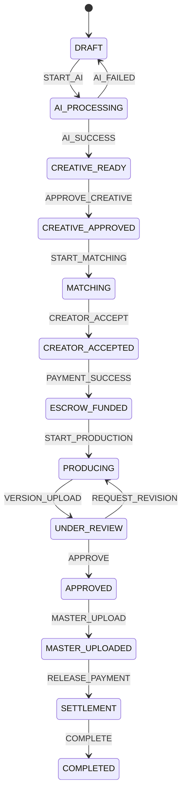
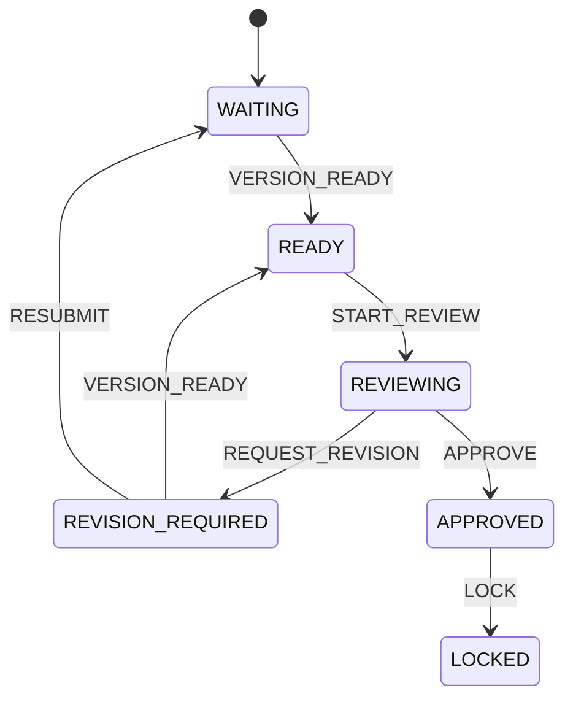

# State Machine Specification

> Vol 18 — all business status changes must use `runTransition()` from `lib/core/transition-runner.ts`

## Universal Interface

```typescript
interface StateMachine<TState, TEvent> {
  canTransition(current: TState, event: TEvent): boolean;
  transition(current: TState, event: TEvent): TState;
  getAvailableEvents(current: TState): TEvent[];
}
```

Implementation: `lib/core/state-machine.ts`  
All machines: `features/shared/state-machines/`

## Campaign



Code: `features/campaign/campaign.state-machine.ts`

## Review (per version)



Max 3 revision rounds — then admin intervention.

Code: `features/review/review.state-machine.ts`

## Version (video processing)

```mermaid
stateDiagram-v2
  UPLOADING --> PROCESSING --> TRANSCODING --> GENERATING_HLS
  GENERATING_HLS --> AI_ANALYZING --> READY --> REVIEWING
  REVIEWING --> APPROVED --> MASTER
  UPLOADING --> FAILED: FAIL
  FAILED --> UPLOADING: RETRY
```

Code: `features/shared/state-machines/version.state-machine.ts`

## Side Effects Rule (Ch.14)

```
Transition → Persist → Audit Log → Publish Event → Worker (email/push/ws)
```

**禁止**在状态转换中直接发邮件或 Push。

## Cursor Rules (Ch.18)

- 禁止 `campaign.status = "APPROVED"`
- 必须 `campaignService.transition(id, "APPROVE", actor)`
- 每次 Transition：验证 + 事务 + Event + Audit + Permission
